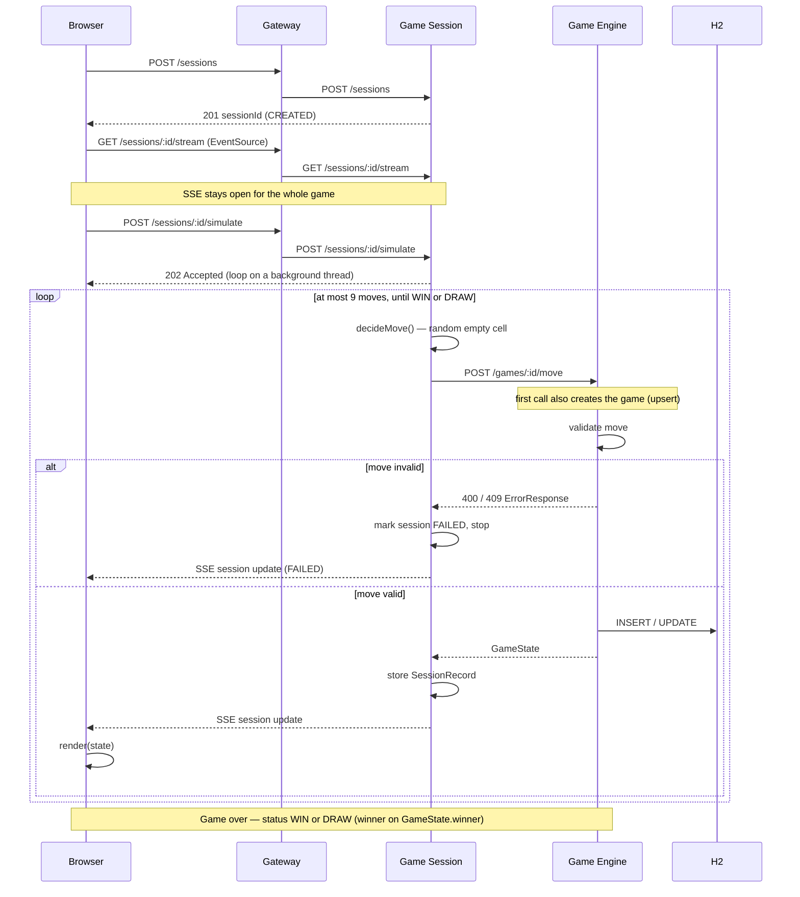
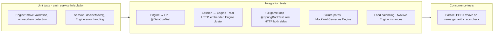

<div style="text-align:center;">

# Tic Tac Toe

**A self-playing, microservice-based Tic Tac Toe game** — the board fills itself in real time while a service orchestrator plays random moves against the game engine.

<div style="text-align:center; white-space:nowrap;"> <a href="https://github.com/andrey56097/tik-tak-toe/actions/workflows/ci.yml"></a> </div>

---
<div style="text-align:center;">


</div>

---

## 📖 Table of Contents

- [About](#about)
- [Features](#features)
- [Tech Stack](#tech-stack)
- [Architecture](#architecture)
- [How It Works](#how-it-works)
- [Assignment coverage](#assignment-coverage)
- [Getting Started](#getting-started)
  - [Prerequisites](#prerequisites)
  - [Build](#build)
  - [Run with Docker](#run-with-docker)
  - [Run on Kubernetes](#run-on-kubernetes)
  - [Run from source](#run-from-source)
  - [Test](#test)
- [Project Structure](#project-structure)
- [API Surface](#api-surface)
- [Roadmap](#roadmap)
- [Testing Strategy](#testing-strategy)
- [Continuous Integration](#continuous-integration)
- [Git Workflow](#git-workflow)
- [Possible Improvements](#possible-improvements)
- [License](#license)

---

## About

This repository implements a **distributed Tic Tac Toe**: independent services for game rules, session orchestration, and UI, wired through Eureka and a Spring Cloud Gateway. The board updates live in the browser while the session service plays both sides against the engine.

Built as a production-shaped system — layered services, Strategy / Repository / Adapter / DTO, shared error contract, retries and timeouts, admission limits, metrics and tracing, CI with coverage and mutation gates — not a demo monolith with service names.

> **Status:** ready for submission. The full stack runs behind `localhost:8080` (`docker compose up` or from source). Milestones 1–11 are closed on the [Roadmap](#roadmap). Residual limits are listed under [Known gaps](#known-gaps), not unfinished milestones.
>
> **Requirements:** [docs/task.md](docs/task.md) is authoritative. The [implementation plan](docs/tic-tac-toe-plan.md) tracks it item-by-item.

---

## Features

| | |
|------|------|
| 🤖 **Self-playing game** | The session orchestrator picks a move (random strategy for v1), submits it, and repeats until the game ends. |
| 🏗️ **Microservice architecture** | Game engine, session orchestrator, UI, service discovery, and gateway as independent deployable units. |
| ⚡ **Live board** | Full session state pushed over **SSE**; one `render(state)` redraw — never deltas — so the delivery channel stays swappable. |
| 🗺️ **Service discovery & routing** | Netflix Eureka registers every service; Spring Cloud Gateway is the single entry point (`:8080`) and routes by service name. |
| 🗄️ **Persistent-by-design state** | Engine: H2 behind JPA (`@Version` optimistic locking). Session: in-memory store with TTL eviction and a hard capacity ceiling. |
| 🐳 **Dockerized** | `docker compose up` starts all five services in isolated containers that reach each other over the compose network by service name. |
| 🧪 **Tested** | Unit + integration + concurrency suites; JaCoCo and Pitest gates on `common`, engine, and session; Vitest for the static UI. |
| 🔄 **CI** | GitHub Actions runs `./gradlew build` on every push and PR. A red build blocks the merge. |

---

## Tech Stack

| Layer | Technology |
|------|------|
| **Language** | [Java 21 (LTS)](https://www.oracle.com/java/technologies/downloads/) |
| **Framework** | [Spring Boot 4.1.x](https://spring.io/projects/spring-boot) |
| **Cloud** | [Spring Cloud 2025.1.2 "Oakwood"](https://spring.io/projects/spring-cloud) — Eureka, Gateway |
| **Data** | Spring Data JPA + [H2](https://www.h2database.com/) (in-memory) |
| **Realtime** | **Server-Sent Events** — native `EventSource`, no JS libraries |
| **HTTP Client** | Spring `RestClient` (synchronous, `@LoadBalanced`, connect + read timeouts, `@Retryable`) |
| **Observability** | Micrometer metrics + Prometheus scrape; Micrometer Tracing (W3C `traceparent`) |
| **Build** | Gradle 9.x (wrapper) + Kotlin DSL |
| **Testing** | JUnit 5, Mockito, MockWebServer, JaCoCo, Pitest, Vitest/jsdom |
| **Ops** | Docker Compose · Kubernetes manifests (`k8s/`) |
| **CI/CD** | GitHub Actions (`./gradlew build` on push/PR) |

---

## Architecture


**How the pieces fit together:**

1. The **browser** talks only to the **gateway** (`:8080`) — it never knows internal service ports.
2. The gateway routes requests **by service name** (`lb://GAME-SESSION-SERVICE`, …) using addresses it discovers from **Eureka**.
3. The **Game Session Service** orchestrates a whole game: it calls its own move strategy and submits each move over **REST** (the move endpoint creates the game on first use), recording the fresh board after each one. The **UI service serves only the static page** — the board in the browser reads state from Session over an **SSE** stream.
4. The **Game Engine Service** owns the rules: move validation, winner detection, and persistence to **H2**.

> Sequence of one full game is in [How It Works](#how-it-works); the longer rationale lives in the [implementation plan](docs/tic-tac-toe-plan.md#one-game-cycle-sequence).

**Architectural patterns used:**

- **Orchestration** — the Game Session Service is a single central coordinator (`GameSessionOrchestrator`) that drives the auto-play workflow: create game → decide move → submit → check status → repeat. **Not a Saga**: there are no compensating operations — a failed step ends the session with an error rather than undoing earlier ones (adequate for auto-play; `task.md` doesn't require distributed atomicity).
- **Layered Architecture** inside each service (Controller → Service → Repository).
- **API Gateway + Service Discovery** — single entry point routing by service name via Eureka.
- **Ports & Adapters (partially)** — business logic depends on interfaces (`GameRepository`, `MoveStrategy`, `GameEngineClient`); concrete adapters are plugged in via DI.
- **Publish-Subscribe / Observer** — `GameUpdatePublisher`: Session publishes a state update, subscribed browsers receive it over SSE, and neither knows the other directly.
- **DTO pattern** — JPA entities stay separate from API models.

---

## How It Works

Who does what (per `docs/task.md`):

| Component | Role in moves |
|------|------|
| **UI** | Displays the board in real time, triggers simulation (`Start Simulation` → `POST /sessions/{id}/simulate`), shows status and move history. **Never generates moves.** |
| **Game Session** | **Generates moves** (`decideMove()`, random strategy in v1) and orchestrates the auto-play loop. |
| **Game Engine** | **Validates and applies** moves, detects winner/draw, owns persistence. |

So: **moves are made on the backend** — the Game Session decides the move, the Engine checks and applies it. The UI only renders and triggers.



ASCII sketch of the same flow:

```
POST /sessions  ──▶  session starts  ──▶  Game Session creates a game in the Engine
       │                                          │
       ▼                                          ▼
   browser watches              loop:  decideMove() → POST /games/:id/move
       ▲                              │
       │                              ▼
  full session state ◀──────  new GameState after every move
  (pushed over SSE as each move lands)
       │
       ▼
  Board redraws until status ∈ {WIN, DRAW}
```

---

## Assignment coverage

Mapped from [docs/task.md](docs/task.md). Everything required — and the listed optionals — is implemented and tested.

### Testing & Validation
| Requirement | Evidence |
|---|---|
| Inter-service REST (Session ↔ Engine) | `RestGameEngineClient` + Milestone 7 ITs (`SessionEngineFullGameIT`, load-balancing, wire contract) |
| Consistent state across services | Engine H2 + Session store; full-game and SSE ITs assert board/history/outcome |
| Error handling (invalid moves, Engine down) | Domain → `ErrorResponse`; `EngineUnavailableIT`, `EngineConnectionRefusedIT`, validation 400/409 |
| Full flow: create → simulate → outcome | `SessionEngineFullGameIT`, `scripts/smoke.sh`, Compose/K8s demos |

### Optional enhancements
| Requirement | How |
|---|---|
| Concurrency | Engine `@Version` → 409 on conflicting writes; Session admission semaphores (store + simulations) |
| Eureka + Gateway | Milestones 2 and 6 — single entry at `:8080` |
| Persistence | Engine: JPA + H2 (file mode is a one-line swap). Session: in-memory with TTL + capacity |
| Real-time UI | SSE `GET /sessions/{id}/stream` (Milestone 5) |

### Submission checklist
| Item | Where |
|---|---|
| Code quality | Layered packages, SOLID seams, shared `common` error contract, mutation gates |
| Documentation | This README — build, run (Compose / K8s / source), test, API, architecture |
| Integration tests | `:game-session-service:integrationTest` in `./gradlew build` |
| Discussion of improvements | [Possible Improvements](#possible-improvements) |

---

## Getting Started

> **Two ways in.** [Run with Docker](#run-with-docker) starts the whole stack with one command and puts everything behind `localhost:8080`. [Run from source](#run-from-source) starts each service in its own terminal on its own port — Eureka `8761`, Gateway `8080`, Engine `8081`, Session `8082`, UI `8083` — which is what you want while developing. **Do not do both at once**: see the warning at the end of the Docker section.

### Prerequisites

| Requirement | Version |
|------|------|
| [JDK](https://adoptium.net/) | **21** or newer (toolchain pinned to 21) |
| Docker + Compose | Any current version *(required only for [Run with Docker](#run-with-docker); a source run needs no Docker, and a Docker run needs no JDK)* |
| Gradle | **Not needed** — the repo ships a pinned [Gradle Wrapper](https://docs.gradle.org/current/userguide/gradle_wrapper.html) |

Verify your environment:

```bash
java -version        # → 21+
./gradlew --version  # → prints the pinned Gradle version
```

### Build

```bash
./gradlew build
```

Compiles and tests every module and produces one executable jar per service, in
that service's own `build/libs/` — e.g. `game-engine-service/build/libs/`. There
is no jar at the repository root: the root is a Gradle settings file that
aggregates the modules, not an application.

### Run with Docker

```bash
docker compose up --build
```

That is the whole thing. Compose builds one image per service from
[`docker/Dockerfile`](docker/Dockerfile), starts all five on a private network
and waits for each to report healthy before starting the ones that depend on it.
Then open **<http://localhost:8080>**.

The **first** build takes around ten minutes: the jars are compiled *inside* the
images, so a clean machine needs no JDK and no prior `./gradlew build`, and the
five builds run one at a time because they share a locked Gradle cache. Later
runs start in seconds. Stop everything with `docker compose down`.

**Only two ports are published**, and that is the point of the design:

| URL | What |
|---|---|
| **<http://localhost:8080>** | Everything the browser needs — the board, the `/sessions` API and the SSE stream, all through the gateway |
| <http://localhost:8761> | The Eureka dashboard, to see all four services registered |

Engine, Session and UI are reachable only from inside the compose network. The
browser never learns their ports — that is what the gateway is for.

To check a stack without opening a browser:

```bash
./scripts/smoke.sh
```

It brings the stack up, creates a session through the gateway, plays it to a
finish, prints the result and tears everything down — exiting non-zero if any of
that fails. `KEEP_UP=true ./scripts/smoke.sh` leaves the stack running instead.

> **Stop the source-run stack before `docker compose up`.** Compose publishes
> Eureka on `8761`, and every `application.yml` points at
> `http://localhost:8761/eureka/` — so a service you started from source
> registers itself into the *containerised* registry as a second instance of the
> same service id, under your machine's LAN address. The gateway then alternates
> between the container (which answers) and your host (which it cannot reach
> from inside the network), and every second request fails with a 500. The
> symptom looks like a page that loads without styles. `docker compose restart
> eureka-server` clears the stale entries once the host processes are stopped.

### Run on Kubernetes

The same five images, deployed to a cluster. Nothing in the application changed
to make this work: no Java, no `application.yml`. The container-only values that
compose passes as environment variables are passed here by a ConfigMap, and
**Eureka still does the service discovery** — Kubernetes only gives it a stable
name to answer at.

```bash
minikube start
minikube addons enable ingress
./scripts/k8s-smoke.sh
```

That script is the whole path: it builds any missing image, loads all five into
the cluster, applies [`k8s/`](k8s/), waits for every Deployment, plays a full
game through the gateway and deletes everything again — exiting non-zero if any
step fails. `KEEP_UP=true ./scripts/k8s-smoke.sh` leaves it running.

To drive it by hand instead:

```bash
docker compose build                                  # if the images are not built yet
for s in eureka-server game-engine-service game-session-service ui-service gateway; do
  minikube image load tiktaktoe/$s:dev
done
kubectl apply -k k8s/
```

Then reach it either way:

| Command | URL | Needs |
|---|---|---|
| `minikube tunnel` | **<http://localhost>** — through the Ingress, exactly as a browser would arrive | sudo |
| `kubectl -n tik-tak-toe port-forward svc/gateway 8080:8080` | <http://localhost:8080> — straight to the gateway, bypassing the Ingress | nothing |

`kubectl delete -k k8s/` removes the namespace and everything in it.

**Loading the images takes a few minutes** — five images of roughly 600 MB each,
transferred into the cluster one at a time. Nothing pushes them to a registry, so
the manifests set `imagePullPolicy: IfNotPresent`: a Pod that decided to pull
would fail, because there is nowhere to pull from.

Three things are worth knowing before relying on this:

- **The registry holds Pod IPs.** Clients register with
  `EUREKA_INSTANCE_PREFER_IP_ADDRESS=true`, so a rescheduled Pod leaves a stale
  entry until its lease expires. Small at one replica with a 5-second renewal,
  and it is the honest cost of keeping client-side discovery inside a cluster
  that has discovery of its own.
- **Sessions live in memory.** A rolling update or an evicted Pod drops every
  game in flight. The fix is a shared `SessionStore`, not a Kubernetes setting.
- **Every service runs at one replica**, and for three different reasons: Eureka
  has no peer configured, the engine's H2 database is inside its own Pod, and the
  session store is in-memory. Only the UI is genuinely free to scale.

There are **no Secrets** in the cluster. H2 runs in-memory with no password and
the gateway has no credentials, so an applied-but-empty Secret would be
decoration; [`k8s/secret.yaml.example`](k8s/secret.yaml.example) documents the
mechanism instead, ready for the day the engine points at a real database. (The
OpenRouter key used by the automated PR review is a *CI* secret and lives in
GitHub Secrets — no deployed service reads it.)

### Run from source

These are independent Spring Boot applications with no shared root project, so
there is no single "start the app" command. Start them in this order — Eureka
first, so the others have a registry to register with — each in its **own
terminal**, because every one of these commands blocks:

```bash
./gradlew :eureka-server:bootRun          # :8761  service registry
./gradlew :game-engine-service:bootRun    # :8081  rules + H2
./gradlew :game-session-service:bootRun   # :8082  orchestrator
./gradlew :ui-service:bootRun             # :8083  the board page
./gradlew :gateway:bootRun                # :8080  single entry point
```

Then open **<http://localhost:8080>** and press *Start Simulation*. The UI is
still served directly on `8083`, but going through the gateway is what the
browser does in every other setup, so it is the honest way to run it.

> **Do not run `./gradlew bootRun` from the repository root.** The task exists in
> every module, so Gradle would try to start all five inside one build and block
> on the first — the rest never start.

Give Eureka a few seconds before the others: a service that starts while the
registry is still coming up retries on its own, but the first attempt will fail
in the log.

**Executable jars** — same idea, one per service:

```bash
./gradlew :game-engine-service:bootJar
java -jar game-engine-service/build/libs/game-engine-service-0.0.1-SNAPSHOT.jar
```

### Test

```bash
./gradlew test
```

Each module writes its own human-readable report:

```bash
open game-engine-service/build/reports/tests/test/index.html
```

To run one module's suite alone, name it — `./gradlew :game-engine-service:test`.

The Session↔Engine integration suite lives in its own source set and boots real
Engine instances, so it runs separately:

```bash
./gradlew :game-session-service:integrationTest
```

The board page has its own suite — Vitest over jsdom, covering the status wording,
board layout, move formatting and the SSE lifecycle:

```bash
./gradlew :ui-service:check     # installs the toolchain from the lockfile, then runs it
npm --prefix ui-service test    # or directly, if node_modules is already there
```

This is a **test-only** toolchain: the page itself still has no build step, the browser
resolves its ES imports, and nothing here is packaged into the image. Node 22+ is
needed for the Gradle task; CI installs it.

`./gradlew build` includes all of the above, plus JaCoCo and Pitest gates on
`common`, engine, and session (see [Continuous Integration](#continuous-integration)).

> **Stop the stack before running the full build.** `EurekaServerApplicationTest`
> starts the Eureka server on its real port (`DEFINED_PORT`, 8761), so
> `./gradlew build` fails with `PortInUseException` while the services are
> running locally. CI runs on a clean machine and is unaffected.

### Gradle task reference

| Task | Description |
|------|------|
| `./gradlew build` | Full build of every module — compile + test + package, plus the Session↔Engine integration suite, JaCoCo coverage gates and Pitest (takes a while) |
| `./gradlew test` | Run every module's test suite |
| `./gradlew :ui-service:npmTest` | Run the page's Vitest suite alone |
| `./gradlew :<module>:bootRun` | Start one service — e.g. `:ui-service:bootRun`. There is no root-level `bootRun`; see [Run](#run) |
| `./gradlew :<module>:bootJar` | Package one service as an executable jar |
| `./gradlew clean` | Delete all build outputs |

---

## Project Structure

A monorepo of five independent Spring Boot services plus one shared module.
There is no root application and no shared parent build: the root
`settings.gradle.kts` only aggregates the modules, and `common` is the single
dependency any of them share.

```
tik-tak-toe/
├── common/                  # Shared DTOs: GameState, MoveRequest, CellState, GameStatus
├── eureka-server/           # Service discovery                         :8761
├── gateway/                 # Spring Cloud Gateway — single entry point  :8080
├── game-engine-service/     # Game rules, validation, H2 persistence     :8081
├── game-session-service/    # Orchestrator: auto-play loop               :8082
├── ui-service/              # Serves the static HTML/CSS/JS board        :8083
├── docker/Dockerfile        # One multi-stage recipe, built once per service
├── docker-compose.yml       # The five services, one network, one command
├── scripts/smoke.sh         # Up → play a game through :8080 → down
├── docs/
│   ├── task.md              #   Assignment requirements (source of truth)
│   └── tic-tac-toe-plan.md  #   Full implementation plan & architecture
├── .claude/                 # Claude Code workspace — plans, skills, hooks, settings
├── .github/workflows/       # CI (build + test + quality) and AI PR review
├── gradle/wrapper/          # Pinned Gradle distribution
├── settings.gradle.kts      # Aggregates the six modules
└── gradlew / gradlew.bat    # Wrapper scripts
```

Each service keeps its own `build.gradle.kts` and its own jar in
`<module>/build/libs/`; layers live in subpackages under
`com.flamingo.tiktaktoe.<service>` — `controller`, `service`, `domain`,
`repository`, `validation`, `exception` — and the tests mirror them.

---

## API Surface

> All three services are live; the **Status** column marks what is not built yet.
> The **Source** column separates the endpoints `task.md` names — five, and they
> match it path for path — from the ones this implementation adds. No `/api`
> prefix anywhere: the assignment names the paths directly and Milestone 1
> settled on matching it.

| Method | Path | Service | Description | Success | Errors | Source | Status |
|---|---|---|---|---|---|---|---|
| `POST` | `/games/{gameId}/move` | Engine | Submit a move; creates the game if the id is unknown | `200` | `400` `409` | `task.md` | live · M1 |
| `GET` | `/games/{gameId}` | Engine | Fetch current board state and status | `200` | `404` | `task.md` | live · M1 |
| `POST` | `/sessions` | Session | Create a session; the id doubles as the `gameId` | `201` | — | `task.md` | live · M3 |
| `POST` | `/sessions/{sessionId}/simulate` | Session | Start the simulation; returns at once, the game runs in the background | `202` | `404` `409` | `task.md` | live · M3 |
| `GET` | `/sessions/{sessionId}` | Session | Session details, move history, current game state | `200` | `404` | `task.md` | live · M3 |
| `GET` | `/` | UI | The board page | `200` | — | added | live · M4 |
| `GET` | `/actuator/health` | Engine, Session, UI | Liveness for Eureka and operators | `200` | — | added | live |
| `GET` | `/v3/api-docs`, `/swagger-ui.html` | Engine, Session | OpenAPI spec and Swagger UI, generated from the code | `200` | — | added | live |
| `GET` | `/sessions/{sessionId}/stream` | Session | Subscribe to live state updates (`text/event-stream`) | `200` | `404` | added | live · M5 |

Every error body is the shared `ErrorResponse` — `{timestamp, status, error,
message, path}` — from the `common` module, never a raw exception string.

The stream is the only endpoint beyond the five the assignment names, and it is
a deliberate addition: any push mechanism needs something to connect to, and a
stream and a snapshot want different timeouts, buffering and caching than
`GET /sessions/{id}` does. The reasoning is in the
[plan](docs/tic-tac-toe-plan.md).

All public routes are reachable through the gateway on `localhost:8080`. When
the services are started from source rather than with Compose, each is also
callable on its own port — Engine `8081`, Session `8082`, UI `8083` — which is
how the Swagger UIs are reached.

**API docs** are generated from the code by **springdoc-openapi**, so they cannot drift from the contract — kept per service (KISS) rather than aggregated at the gateway.

---

## Roadmap

Ordered so each stage builds on the last. The **Scope** column says what the
assignment actually demands: `task.md` names three required components and lists
service discovery, an API gateway and real-time updates as *optional
enhancements*. Optional stages are still built — they are ordered where they fit
logically, not where their priority would put them.

| # | Milestone | Scope | Status | Result |
|---|---|---|---|---|
| 0 | Environment & monorepo skeleton | enabler | ✅ | 5 independent Spring Boot projects + `common` module |
| 1 | **Game Engine Service + H2** | **required** | ✅ | Rules, validation, error handling, persistence — fully tested |
| 2 | Eureka Server + registration | optional | ✅ | Engine visible in the service registry |
| 3 | **Game Session Service** | **required** | ✅ | Orchestrator that plays a full game automatically |
| 4 | **UI Service** | **required** | ✅ | Static board page; full-state `render(state)` (transport-agnostic) |
| 5 | SSE push Session → UI | optional | ✅ | Live updates via `GET /sessions/{id}/stream` — no polling |
| 6 | Gateway | optional | ✅ | Everything reachable through `localhost:8080` |
| 7 | Testing & validation | **required** | ✅ | Integration, error-handling, and concurrency suite |
| 8 | CI (build + test + quality) | beyond scope | ✅ | GitHub Actions: K8s manifest check + `./gradlew build` (tests, coverage, Pitest, Vitest) |
| 9 | Docker + docker-compose | beyond scope | ✅ | Whole stack up with one command — see [Run with Docker](#run-with-docker) |
| 10 | Final polish & submission | **required** | ✅ | Admission limits, metrics + tracing, UI tests, docs truth pass |
| 11 | Kubernetes readiness | beyond scope | ✅ | Manifests that deploy the stack to a cluster — see [Run on Kubernetes](#run-on-kubernetes) |

Full details — version decisions, design patterns, and the assignment-requirements matrix — live in **[docs/tic-tac-toe-plan.md](docs/tic-tac-toe-plan.md)**.

---

## Testing Strategy



`./gradlew test` runs every module's unit/slice suite; `./gradlew build` also runs
the Session↔Engine integration suite (`:game-session-service:integrationTest`), the
UI Vitest suite, and gates line coverage (JaCoCo, 80 %) and mutation score
(Pitest, 80 %) on `common`, `game-engine-service`, and `game-session-service`.
Integration tests boot real Engine instances in the test JVM
(`EmbeddedEngineCluster`) and drive Session over HTTP — no mocks on that path.

---

## Observability

Both REST services expose Micrometer metrics on `/actuator/prometheus` (scraped, not
pushed — the stack needs no external service to run) and emit W3C trace context on the
Session → Engine call, so a game can be followed across both services.

| Meter | Type | Tags |
|---|---|---|
| `tiktaktoe.simulation` | timer | `outcome` = `completed` \| `failed` |
| `tiktaktoe.simulation.failed` | counter | `reason` |
| `tiktaktoe.simulation.moves` | counter | — |
| `tiktaktoe.moves.applied` | counter | `status` = `IN_PROGRESS` \| `WIN` \| `DRAW` |
| `tiktaktoe.moves.rejected` | counter | `reason` |
| `tiktaktoe.games.created` | counter | — |

Tag values are fixed by design — a game or session id must never become a tag, since
each distinct value is a new time series. Traces are sampled at 1.0 (a development
setting) and exported only if `OTEL_EXPORTER_OTLP_ENDPOINT` points at a collector.
Every log line carries `[service,traceId,spanId]`.

Swapping Prometheus for a vendor backend (Datadog and friends) is a registry
dependency, not a rewrite: the meter names above do not change.

## Continuous Integration

Every pull request to `main` and every push to `main` runs
[`.github/workflows/ci.yml`](.github/workflows/ci.yml) on Temurin 21 + Node 22:

1. Validate `k8s/` with `kubectl kustomize` + kubeconform
2. `./gradlew build --continue` — compile, unit + integration tests, Vitest, JaCoCo, Pitest, package

| Layer | Where it comes from | Threshold |
|---|---|---|
| Compile + unit/integration/UI tests | `build` → `check`, every module | all green |
| Line coverage | `jacocoTestCoverageVerification` — `common`, engine, session | 80% |
| Mutation score | `pitest` — `common`, engine, session | 80% |

Failed runs upload test / JaCoCo / Pitest reports as `reports-<run_id>`. Successful runs upload nothing.

`main` is protected: the `build` job is a required status check. Docs-only commits may still land on `main` (admin bypass).

---

## Git Workflow

- `main` is always stable and runnable.
- **Code and test work happens on a separate branch** — never commit code or tests directly to `main`. Milestones use `milestone-<number>` (e.g. `milestone-4`) — no slash, the number is enough; other code work uses `feature/<name>`, `fix/<name>`, `chore/<name>`. **Docs and rule changes go straight to `main`.**
- **Commit and PR titles start with `[MILESTONE-<n>]`**, so the stage is clear at a glance.
- **Code and its tests live on the same branch**, committed together (atomic commits).
- **Code review is mandatory before merge** — a reviewer pass gates merging into `main`.
- Commits are **atomic** — one logical step per commit, with a meaningful message.

---

## Possible Improvements

Future work, deliberately outside the current scope. The first group is
**known gaps in what is built** — each is a real limitation, not a wish. The
second is optional direction and alternative designs.

### Known gaps

Honest limits of the current deployable shape — not unfinished assignment items.

- **Timeout recovery on Session → Engine.** A read timeout is retried, so a move Engine did apply can be submitted twice. Engine's turn check rejects the duplicate with a 409, so the board never corrupts — but the session ends `FAILED`. Turning that 409 into recovery (re-read the game, resume from Engine's state) closes it.
- **Anyone can create games.** `POST /games/{gameId}/move` is an upsert, so any well-formed id materialises a game. That is what lets Session skip a separate create call, but it also means an unauthenticated caller can fill the store one id at a time. `task.md` specifies no authentication, so this waits for whatever auth arrives — or for a quota/eviction policy.
- **Engine keeps every game.** `InMemorySessionStore` now sweeps finished sessions on a TTL and refuses new ones past a ceiling (503), but the Engine's H2 has no equivalent — every game ever played stays for the life of the process.
- **Session crash mid-simulation orphans the game.** The Engine-side game stays `IN_PROGRESS` with no one driving it. Orchestration state is in-memory only; there is no idempotency key on the Session → Engine move call.
- **`MoveRequest` carries no `row`/`col` bounds annotations.** Out-of-range coordinates are rejected by `MoveValidator` with a 400, so the contract holds, but the error reads as "cell not playable" rather than naming the offending field.
- **`CellState` doubles as the player symbol.** `MoveRequest.player` is typed `CellState`, so `EMPTY` is syntactically expressible; it is rejected at validation with a 400 rather than by the type system. A separate `Player` type is the clean fix and a breaking contract change.
- **No authentication and no rate limiting.** Every endpoint is open. Deliberate for an assignment with no user model, and the first thing to add before any real exposure — the session ceiling bounds memory, not abuse.
- **No production database or schema migrations.** The Engine uses in-memory H2 with `ddl-auto: update`; production persistence needs Postgres, Flyway and `ddl-auto: validate`.
- **No telemetry backend or operational response.** Metrics and traces are emitted, but Compose starts no OpenTelemetry Collector, Prometheus/Grafana dashboard, alert rules or incident runbook; set `OTEL_EXPORTER_OTLP_ENDPOINT` only after adding that pipeline.
- **No release verification gate.** Before a deployment, run the full `./gradlew build --continue`, the Docker smoke scenarios and a deployment-specific health check; current CI validates code but does not publish an image or deploy it.
- **One game per session, for ever.** `sessionId` doubles as `gameId`, as `task.md` permits, so a session cannot hold a second game.
- **Cross-service trace correlation is unproven end to end.** The outbound client is instrumented (`http.client.requests`), which is what puts `traceparent` on the wire, and both services log `traceId`/`spanId` — but a successful game writes no application log lines, so a single id has not been observed in both logs at once.
- **The browser code has no *visual* tests.** Milestone 10 added Vitest/jsdom tests over the page's logic — status wording, board layout, move formatting, and the SSE lifecycle including stream teardown on every failure path. What they cannot see is rendering: a real defect (marks jumping between grid rows, the glyph outgrowing its cell at large font sizes) was found by driving a browser by hand. Playwright remains the agreed direction for that, and stays open work.

### Optional direction

- **Modular monolith as the alternative we did not take.** `task.md` names three components; they could have lived in one Spring Boot process with three packages — simpler to run, no Eureka, no Gateway, no distributed timeouts. We split them into independently deployable services (Engine rules, Session orchestration, UI, plus discovery and the gateway) so each can fail and scale on its own, which is the point of the exercise. Further splits (a History service, a dedicated Move service) would be over-decomposition for a 3×3 board.
- **Minimax** move strategy instead of random (with alpha-beta pruning) — `MoveStrategy` is already the seam; random is v1.
- **Early draw detection** — detect a draw before the board is full; a full-board check is currently sufficient for auto-play.
- **Full reactive stack (WebFlux)** for Engine and Session — `task.md` imposes no reactivity constraint; both services are blocking MVC today, and Session → Engine uses synchronous `RestClient`.
- **Message broker (Kafka / RabbitMQ) instead of synchronous REST.** Today Session calls Engine and waits. A timeout then retries a write that may already have landed (see Known gaps). A broker would turn that into `MoveCommand` in / `GameState` out: Session does not block on Engine's availability, a crash can resume from the last event, and several Session replicas can share one Engine without each holding an HTTP connection. Kafka fits if you want a durable, replayable log of moves; RabbitMQ fits if you only need a work queue. Either is heavier than nine REST calls for a finished game — the existing `GameEngineClient` port is what makes the swap possible without touching the orchestrator.
- **Persistent H2 (file mode)** for Engine state recovery across restarts — a one-line JDBC URL change; still not a production database.
- **Persist history in a DB** — track session/move history and win/loss outcomes across games instead of the in-memory `SessionStore`.
- **Shared session state** — an in-memory `SessionStore` pins Session to one replica and loses games on a rolling update. A shared store (Redis / JDBC) is what lets Session scale horizontally.
- **Multi-instance SSE** — `SseGameUpdatePublisher` holds emitters in a local map. If Session has more than one pod, the stream and the simulation can land on different instances. Redis/Rabbit pub-sub would fan the same `SessionResponse` out to every replica.
- **Circuit breaker** via `resilience4j-spring-boot4` — retries already cover a brief blip; a breaker would stop hammering an Engine that is down for longer and fail fast with 503 instead of waiting out every retry budget.
- **Durable workflow for simulations** — replace `@Async` + `Thread.sleep` with Temporal (or a message-driven state machine) so a pod restart does not orphan an `IN_PROGRESS` game.
- **WebSocket + STOMP instead of SSE** — SSE matches one-way server → browser with a native `EventSource`. WebSocket wins the moment the browser must *send* on the same channel (pause / step / a human taking over) or when many clients need broker fan-out. The swap is a new `GameUpdatePublisher` plus the one line that feeds `render(state)`.
- **Observability backend** — OpenTelemetry Collector, Prometheus/Grafana dashboards, alert rules and an incident runbook. Metrics and traces are already emitted; Compose just does not start the pipeline.
- **Discovery through Kubernetes itself** — [`k8s/`](k8s/) still uses Eureka so the cluster matches Compose. A real cluster already resolves `game-engine-service` via DNS, so production would drop the registry (or move to Spring Cloud Kubernetes).
- **An image registry and a deploy gate** — nothing is published today (`minikube image load`); CI tests the code but does not push a tag or deploy it.
- **API Gateway rate limiting** — e.g. Redis token bucket via a Gateway `RequestRateLimiter`, on top of whatever auth arrives. The session ceiling bounds memory, not abuse.

---

## License

Distributed under the **MIT License**. See [LICENSE](LICENSE) for more information.

---

<div style="text-align:center;">

*Built for the distributed-systems Tic Tac Toe assignment. Design and milestone history: [implementation plan](docs/tic-tac-toe-plan.md).*

</div>
