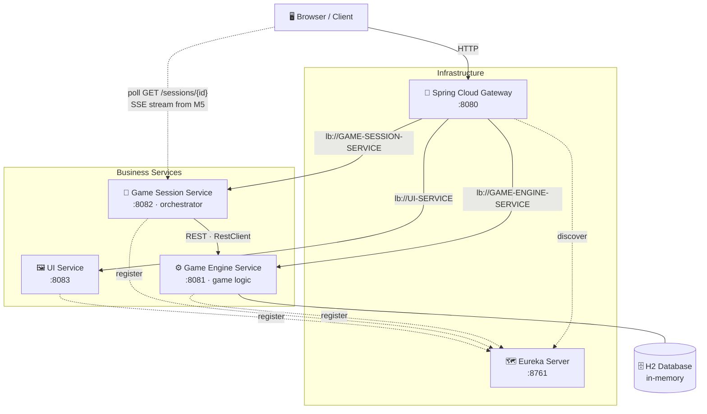

  

---

<pre>
 _____ _____ _   __  _____ ___   _   __  _____ _____ _____
|_   _|_   _| | / / |_   _/ _ \ | | / / |_   _|  _  |  ___|
  | |   | | | |/ /    | |/ /_\ \| |/ /    | | | | | | |__
  | |   | | |    \    | ||  _  ||    \    | | | | | |  __|
  | |  _| |_| |\  \   | || | | || |\  \   | | \ \_/ / |___
  \_/  \___/\_| \_/   \_/\_| |_/\_| \_/   \_/  \___/\____/

        ┌───┬───┬───┐
        │ X │ O │   │
        ├───┼───┼───┤
        │   │ X │ O │
        ├───┼───┼───┤
        │ O │   │ X │
        └───┴───┴───┘
</pre>

---

## 📖 Table of Contents

- [About](#about)
- [Features](#features)
- [Tech Stack](#tech-stack)
- [Architecture](#architecture)
- [How It Works](#how-it-works)
- [Getting Started](#getting-started)
  - [Prerequisites](#prerequisites)
  - [Build](#build)
  - [Run](#run)
  - [Test](#test)
- [Project Structure](#project-structure)
- [API Surface](#api-surface)
- [Roadmap](#roadmap)
- [Testing Strategy](#testing-strategy)
- [Continuous Integration](#continuous-integration)
- [Git Workflow](#git-workflow)
- [Possible Improvements](#possible-improvements)
- [License](#license)

---

## About

This repository implements a **Tic Tac Toe**: the game is not a single monolith but a set of independent services — a *game engine* (rules & persistence), a *game session* (orchestrator that pla[...]

The assignment is treated as a production-grade distributed system: layered services, design patterns (Strategy, Repository, Adapter, DTO), proper error handling, and a comprehensive test suite ��[...]

> **Status:** 🔨 in development, and **all three components `task.md` requires now exist and play together** — the **Game Engine** (rules, H2, upsert move endpoint), the **Game Session** orche[...]
>
> **Requirements source:** the assignment is authoritative in [docs/task.md](docs/task.md) (the home assignment). The implementation plan is built on it and tracks it item-by-item.

---

## Features

| | |
|------|------|
| 🤖 **Self-playing game** | The session orchestrator picks a move (random strategy for v1), submits it, and repeats until the game ends. |
| 🏗️ **Microservice architecture** | Game engine, session orchestrator, UI, service discovery, and gateway as independent deployable units. |
| ⚡ **Live board** | The page redraws from full session state as each move lands — by polling today, pushed over **SSE** from Milestone 5. The renderer never sees the difference. |
| 🗺️ **Service discovery & routing** | Netflix Eureka registers services today; Spring Cloud Gateway becomes the single entry point (`:8080`) in Milestone 6. |
| 🗄️ **Persistent-by-design state** | H2 in-memory DB behind a real JPA repository — one line away from file-based persistence. |
| 🐳 **Dockerized** *(planned)* | The whole stack starts with a single `docker-compose up` — isolated containers communicating over the compose network by service name. |
| 🧪 **Tested end-to-end** | Unit, integration, and concurrency tests across all services. |
| 🔄 **CI/CD** *(partial)* | GitHub Actions reviews every PR today; a build + test + quality workflow lands in Milestone 8. |

---

## Tech Stack

| Layer | Technology |
|------|------|
| **Language** | [Java 21 (LTS)](https://www.oracle.com/java/technologies/downloads/) |
| **Framework** | [Spring Boot 4.1.x](https://spring.io/projects/spring-boot) |
| **Cloud** | [Spring Cloud 2025.1.2 "Oakwood"](https://spring.io/projects/spring-cloud) — Eureka, Gateway |
| **Data** | Spring Data JPA + [H2](https://www.h2database.com/) (in-memory) |
| **Realtime** | Browser polling today → **Server-Sent Events** (native `EventSource`, no JS libraries) from Milestone 5 |
| **HTTP Client** | Spring `RestClient` (synchronous, `@LoadBalanced`, connect + read timeouts) |
| **Build** | Gradle 9.x (wrapper) + Kotlin DSL |
| **Testing** | JUnit 5, Mockito, WireMock, Testcontainers *(optional)* |
| **Ops** | Docker + docker-compose |
| **CI/CD** | GitHub Actions (build + test + quality on push/PR) · Kubernetes readiness for deployment when needed |

---

## Architecture

---

