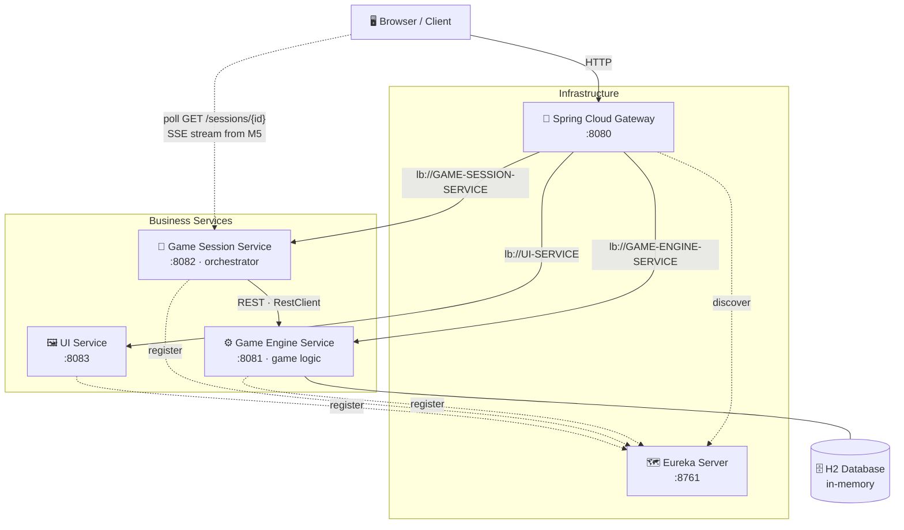
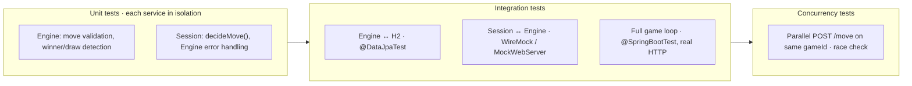

<div style="text-align:center; white-space:nowrap;"> <a href="https://github.com/andrey56097/tik-tak-toe/actions/workflows/ci.yml"></a> </div>

---
<div style="text-align:center;">
<pre>
 _____ _____ _   __  _____ ___   _   __  _____ _____ _____
|_   _|_   _| | / / |_   _/ _ \ | | / / |_   _|  _  |  ___|
  | |   | | | |/ /    | |/ /_\ \| |/ /    | | | | | | |__
  | |   | | |    \    | ||  _  ||    \    | | | | | |  __|
  | |  _| |_| |\  \   | || | | || |\  \   | | \ \_/ / |___
  \_/  \___/\_| \_/   \_/\_| |_/\_| \_/   \_/  \___/\____/

        ┌───┬───┬───┐
        │ X │ O │   │
        ├───┼───┼───┤
        │   │ X │ O │
        ├───┼───┼───┤
        │ O │   │ X │
        └───┴───┴───┘
</pre>
</div>

---

## 📖 Table of Contents

- [About](#about)
- [Features](#features)
- [Tech Stack](#tech-stack)
- [Architecture](#architecture)
- [How It Works](#how-it-works)
- [Getting Started](#getting-started)
  - [Prerequisites](#prerequisites)
  - [Build](#build)
  - [Run](#run)
  - [Test](#test)
- [Project Structure](#project-structure)
- [API Surface](#api-surface)
- [Roadmap](#roadmap)
- [Testing Strategy](#testing-strategy)
- [Continuous Integration](#continuous-integration)
- [Git Workflow](#git-workflow)
- [Possible Improvements](#possible-improvements)
- [License](#license)

---

## About

This repository implements a **Tic Tac Toe**: the game is not a single monolith but a set of independent services — a *game engine* (rules & persistence), a *game session* (orchestrator that plays the game), and a *UI* — connected through service discovery (Eureka) and an **API gateway**, with the board updating live in the browser as the services play.

The assignment is treated as a production-grade distributed system: layered services, design patterns (Strategy, Repository, Adapter, DTO), proper error handling, and a comprehensive test suite — unit, integration, and concurrency.

> **Status:** 🔨 in development, and **all three components `task.md` requires now exist and play together** — the **Game Engine** (rules, H2, upsert move endpoint), the **Game Session** orchestrator (auto-play, retries, timeouts) and the **UI** (a board that fills itself in the browser), plus **Eureka** registration and the shared `common` contract. The browser currently keeps itself current by polling `GET /sessions/{id}`; Milestone 5 replaces that with an SSE push channel. Not built yet: SSE push, gateway, Docker. The feature table below describes the target system; the [Roadmap](#roadmap) marks what each milestone closes and which are optional per `task.md`.
>
> **Requirements source:** the assignment is authoritative in [docs/task.md](docs/task.md) (the home assignment). The implementation plan is built on it and tracks it item-by-item.

---

## Features

| | |
|------|------|
| 🤖 **Self-playing game** | The session orchestrator picks a move (random strategy for v1), submits it, and repeats until the game ends. |
| 🏗️ **Microservice architecture** | Game engine, session orchestrator, UI, service discovery, and gateway as independent deployable units. |
| ⚡ **Live board** | The page redraws from full session state as each move lands — by polling today, pushed over **SSE** from Milestone 5. The renderer never sees the difference. |
| 🗺️ **Service discovery & routing** | Netflix Eureka registers services today; Spring Cloud Gateway becomes the single entry point (`:8080`) in Milestone 6. |
| 🗄️ **Persistent-by-design state** | H2 in-memory DB behind a real JPA repository — one line away from file-based persistence. |
| 🐳 **Dockerized** *(planned)* | The whole stack starts with a single `docker-compose up` — isolated containers communicating over the compose network by service name. |
| 🧪 **Tested end-to-end** | Unit, integration, and concurrency tests across all services. |
| 🔄 **CI/CD** *(partial)* | GitHub Actions reviews every PR today; a build + test + quality workflow lands in Milestone 8. |

---

## Tech Stack

| Layer | Technology |
|------|------|
| **Language** | [Java 21 (LTS)](https://www.oracle.com/java/technologies/downloads/) |
| **Framework** | [Spring Boot 4.1.x](https://spring.io/projects/spring-boot) |
| **Cloud** | [Spring Cloud 2025.1.2 "Oakwood"](https://spring.io/projects/spring-cloud) — Eureka, Gateway |
| **Data** | Spring Data JPA + [H2](https://www.h2database.com/) (in-memory) |
| **Realtime** | Browser polling today → **Server-Sent Events** (native `EventSource`, no JS libraries) from Milestone 5 |
| **HTTP Client** | Spring `RestClient` (synchronous, `@LoadBalanced`, connect + read timeouts) |
| **Build** | Gradle 9.x (wrapper) + Kotlin DSL |
| **Testing** | JUnit 5, Mockito, WireMock, Testcontainers *(optional)* |
| **Ops** | Docker + docker-compose |
| **CI/CD** | GitHub Actions (build + test + quality on push/PR) · Kubernetes readiness for deployment when needed |

---

## Architecture



**How the pieces fit together:**

1. The **browser** talks only to the **gateway** (`:8080`) — it never knows internal service ports.
2. The gateway routes requests **by service name** (`lb://GAME-SESSION-SERVICE`, …) using addresses it discovers from **Eureka**.
3. The **Game Session Service** orchestrates a whole game: it calls its own move strategy and submits each move over **REST** (the move endpoint creates the game on first use), recording the fresh board after each one. The **UI service serves only the static page** — the board in the browser reads state from Session directly, by polling today and over an **SSE** stream from Milestone 5.
4. The **Game Engine Service** owns the rules: move validation, winner detection, and persistence to **H2**.

> A full game-cycle sequence diagram is in the [implementation plan](docs/tic-tac-toe-plan.md#one-game-cycle-sequence).

**Architectural patterns used:**

- **Orchestration** — the Game Session Service is a single central coordinator (`GameSessionOrchestrator`) that drives the auto-play workflow: create game → decide move → submit → check status → repeat. **Not a Saga**: there are no compensating operations — a failed step ends the session with an error rather than undoing earlier ones (adequate for auto-play; `task.md` doesn't require distributed atomicity).
- **Layered Architecture** inside each service (Controller → Service → Repository).
- **API Gateway + Service Discovery** — single entry point routing by service name via Eureka.
- **Ports & Adapters (partially)** — business logic depends on interfaces (`GameRepository`, `MoveStrategy`, `GameEngineClient`); concrete adapters are plugged in via DI.
- **Publish-Subscribe / Observer** — `GameUpdatePublisher` (Milestone 5): Session publishes a state update, subscribed browsers receive it over SSE, and neither knows the other directly. Until then the browser polls, which needs no publisher at all.
- **DTO pattern** — JPA entities stay separate from API models.

---

## How It Works

Who does what (per `docs/task.md`):

| Component | Role in moves |
|------|------|
| **UI** | Displays the board in real time, triggers simulation (`Start Simulation` → `POST /sessions/{id}/simulate`), shows status and move history. **Never generates moves.** |
| **Game Session** | **Generates moves** (`decideMove()`, random strategy in v1) and orchestrates the auto-play loop. |
| **Game Engine** | **Validates and applies** moves, detects winner/draw, owns persistence. |

So: **moves are made on the backend** — the Game Session decides the move, the Engine checks and applies it. The UI only renders and triggers.

The full flow:

```
POST /sessions  ──▶  session starts  ──▶  Game Session creates a game in the Engine
       │                                          │
       ▼                                          ▼
   browser watches              loop:  decideMove() → POST /games/{id}/move
       ▲                              │
       │                              ▼
  full session state ◀──────  new GameState after every move
  (polled today, pushed over SSE from Milestone 5)
       │
       ▼
  Board redraws until status ∈ {IN_PROGRESS, WIN, DRAW}
```

---

## Getting Started

> **Note:** each service is started on its own port for now — Eureka `8761`, Engine `8081`, Session `8082`, UI `8083`. Once Milestone 9 lands, the whole stack starts with `docker-compose up` — see [Roadmap](#roadmap).

### Prerequisites

| Requirement | Version |
|------|------|
| [JDK](https://adoptium.net/) | **21** or newer (toolchain pinned to 21) |
| Docker + Compose | Latest *(needed from Milestone 9; not required for a local run)* |
| Gradle | **Not needed** — the repo ships a pinned [Gradle Wrapper](https://docs.gradle.org/current/userguide/gradle_wrapper.html) |

Verify your environment:

```bash
java -version        # → 21+
./gradlew --version  # → prints the pinned Gradle version
```

### Build

```bash
./gradlew build
```

Compiles and tests every module and produces one executable jar per service, in
that service's own `build/libs/` — e.g. `game-engine-service/build/libs/`. There
is no jar at the repository root: the root is a Gradle settings file that
aggregates the modules, not an application.

### Run

These are independent Spring Boot applications with no shared root project, so
there is no single "start the app" command. Start them in this order — Eureka
first, so the others have a registry to register with — each in its **own
terminal**, because every one of these commands blocks:

```bash
./gradlew :eureka-server:bootRun          # :8761  service registry
./gradlew :game-engine-service:bootRun    # :8081  rules + H2
./gradlew :game-session-service:bootRun   # :8082  orchestrator
./gradlew :ui-service:bootRun             # :8083  the board page
```

Then open **<http://localhost:8083>** and press *Start Simulation*.

> **Do not run `./gradlew bootRun` from the repository root.** The task exists in
> every module, so Gradle would try to start all four inside one build and block
> on the first — the rest never start.

Give Eureka a few seconds before the others: a service that starts while the
registry is still coming up retries on its own, but the first attempt will fail
in the log.

**Executable jars** — same idea, one per service:

```bash
./gradlew :game-engine-service:bootJar
java -jar game-engine-service/build/libs/game-engine-service-0.0.1-SNAPSHOT.jar
```

### Test

```bash
./gradlew test
```

Each module writes its own human-readable report:

```bash
open game-engine-service/build/reports/tests/test/index.html
```

To run one module's suite alone, name it — `./gradlew :game-engine-service:test`.

> **Stop the stack before running the full build.** `EurekaServerApplicationTest`
> starts the Eureka server on its real port (`DEFINED_PORT`, 8761), so
> `./gradlew build` fails with `PortInUseException` while the services are
> running locally. CI runs on a clean machine and is unaffected.

### Gradle task reference

| Task | Description |
|------|------|
| `./gradlew build` | Full build of every module — compile + test + package (also runs Pitest for the session service, so it takes a while) |
| `./gradlew test` | Run every module's test suite |
| `./gradlew :<module>:bootRun` | Start one service — e.g. `:ui-service:bootRun`. There is no root-level `bootRun`; see [Run](#run) |
| `./gradlew :<module>:bootJar` | Package one service as an executable jar |
| `./gradlew clean` | Delete all build outputs |

---

## Project Structure

```
tik-tak-toe/
├── .claude/                 # Claude Code workspace — commands, agents, skills, plans, hooks
│   ├── hooks/               #   Hook scripts wired up in settings.json
│   └── README.md            #   Claude Code conventions for this repo
├── docs/
│   ├── task.md              #   Assignment requirements (source of truth)
│   └── tic-tac-toe-plan.md  #   Full implementation plan & architecture
├── gradle/wrapper/          # Pinned Gradle distribution
├── src/
│   ├── main/
│   │   ├── java/com/flamingo/tiktaktoe/
│   │   │   └── TikTakToeApplication.java   # Spring Boot entry point
│   │   └── resources/
│   │       └── application.properties
│   └── test/java/com/flamingo/tiktaktoe/
│       └── TikTakToeApplicationTests.java  # Smoke test (@SpringBootTest)
├── build.gradle.kts         # Java 21 · Spring Boot 4.1.0 · Gradle Kotlin DSL
├── settings.gradle
├── gradlew / gradlew.bat    # Wrapper scripts
└── .gitignore
```

**Target structure** — the monorepo will grow to five independent services plus a shared module:

```
tik-tak-toe/
├── common/                  # Shared DTOs: GameState, MoveRequest, CellState, GameStatus
├── eureka-server/           # Service discovery                        :8761
├── gateway/                 # Spring Cloud Gateway — single entry point :8080
├── game-engine-service/     # Game rules, validation, H2 persistence   :8081
├── game-session-service/    # Orchestrator: auto-play loop            :8082
└── ui-service/              # Serves the static HTML/CSS/JS board      :8083
```

---

## API Surface

> All three services are live; the **Status** column marks what is not built yet.
> The **Source** column separates the endpoints `task.md` names — five, and they
> match it path for path — from the ones this implementation adds. No `/api`
> prefix anywhere: the assignment names the paths directly and Milestone 1
> settled on matching it.

| Method | Path | Service | Description | Success | Errors | Source | Status |
|---|---|---|---|---|---|---|---|
| `POST` | `/games/{gameId}/move` | Engine | Submit a move; creates the game if the id is unknown | `200` | `400` `409` | `task.md` | live · M1 |
| `GET` | `/games/{gameId}` | Engine | Fetch current board state and status | `200` | `404` | `task.md` | live · M1 |
| `POST` | `/sessions` | Session | Create a session; the id doubles as the `gameId` | `201` | — | `task.md` | live · M3 |
| `POST` | `/sessions/{sessionId}/simulate` | Session | Start the simulation; returns at once, the game runs in the background | `202` | `404` `409` | `task.md` | live · M3 |
| `GET` | `/sessions/{sessionId}` | Session | Session details, move history, current game state | `200` | `404` | `task.md` | live · M3 |
| `GET` | `/` | UI | The board page | `200` | — | added | live · M4 |
| `GET` | `/actuator/health` | Engine, Session, UI | Liveness for Eureka and operators | `200` | — | added | live |
| `GET` | `/v3/api-docs`, `/swagger-ui.html` | Engine, Session | OpenAPI spec and Swagger UI, generated from the code | `200` | — | added | live |
| `GET` | `/sessions/{sessionId}/stream` | Session | Subscribe to live state updates (`text/event-stream`) | `200` | `404` | added | planned · M5 |

Every error body is the shared `ErrorResponse` — `{timestamp, status, error,
message, path}` — from the `common` module, never a raw exception string.

The stream is the only endpoint beyond the five the assignment names, and it is
a deliberate addition: any push mechanism needs something to connect to, and a
stream and a snapshot want different timeouts, buffering and caching than
`GET /sessions/{id}` does. The reasoning is in the
[plan](docs/tic-tac-toe-plan.md).

> **Known defect (fix in Milestone 5):** Engine answers `500` where it owes
> `400` (a body Jackson cannot bind — an unknown player symbol, a missing field,
> malformed JSON), `404` (an unmapped path) or `405` (a wrong method).
> `GameExceptionHandler` lacks handlers for `HttpMessageNotReadableException`,
> `NoResourceFoundException` and `HttpRequestMethodNotSupportedException`, so all
> three fall into its catch-all. Session already handles the latter two
> correctly. Valid-but-illegal moves and unknown game ids are unaffected — those
> return `400` and `404` today.

Once the gateway lands (Milestone 6), all public routes will be reachable
through `localhost:8080`. Until then each service is called on its own port —
Engine `8081`, Session `8082`, UI `8083`.

**API docs** are generated from the code by **springdoc-openapi**, so they cannot drift from the contract — kept per service (KISS) rather than aggregated at the gateway.

---

## Roadmap

Ordered so each stage builds on the last. The **Scope** column says what the
assignment actually demands: `task.md` names three required components and lists
service discovery, an API gateway and real-time updates as *optional
enhancements*. Optional stages are still built — they are ordered where they fit
logically, not where their priority would put them.

| # | Milestone | Scope | Result |
|---|---|---|---|
| 0 | Environment & monorepo skeleton | enabler | 5 independent Spring Boot projects + `common` module |
| 1 | **Game Engine Service + H2** | **required** | Rules, validation, error handling, persistence — fully tested |
| 2 | Eureka Server + registration | optional | Engine visible in the service registry |
| 3 | **Game Session Service** | **required** | Orchestrator that plays a full game automatically |
| 4 | **UI Service** | **required** | Browser page rendering the live board, kept current by polling |
| 5 | SSE push Session → UI | optional | The board updates the instant a move lands, with no polling traffic |
| 6 | Gateway | optional | Everything reachable through `localhost:8080` |
| 7 | Testing & validation | **required** | Integration, error-handling, and concurrency suite |
| 8 | CI (build + test + quality) | beyond scope | GitHub Actions on every push/PR: build, unit + mutation tests, quality checks |
| 9 | Docker + docker-compose | beyond scope | Whole stack up with one command |
| 10 | Final polish & submission | **required** | README, code style, end-to-end verification |
| 11 | Kubernetes readiness | beyond scope | Manifests to deploy the stack to a cluster when needed |

Full details — version decisions, design patterns, and the assignment-requirements matrix — live in **[docs/tic-tac-toe-plan.md](docs/tic-tac-toe-plan.md)**.

---

## Testing Strategy



---

## Continuous Integration

Every pull request to `main` and every push to `main` runs
[`.github/workflows/ci.yml`](.github/workflows/ci.yml) — a single job that
executes `./gradlew build` from the repository root on Temurin 21.

One command is the entire gate, because the root build already implies it:

| Layer | Where it comes from | Threshold |
|---|---|---|
| Compile + unit/integration tests | `build` → `check` → `test`, every module | all green |
| Line coverage | `jacocoTestCoverageVerification`, `game-engine-service` | 80% |
| Mutation score | `pitest`, `game-engine-service` and `game-session-service` | 80% |

When a run fails, the test, JaCoCo and Pitest reports are attached to it as a
`reports-<run_id>` artifact — the surviving mutants are readable there, which
the step log does not show. Successful runs upload nothing.

`main` is protected: `build` is a required status check, a branch must be up to
date with `main` before merging, and the rule is not enforced for admins so that
docs-only commits can still go straight to `main`.

---

## Git Workflow

- `main` is always stable and runnable.
- **Code and test work happens on a separate branch** — never commit code or tests directly to `main`. Milestones use `milestone-<number>` (e.g. `milestone-4`) — no slash, the number is enough; other code work uses `feature/<name>`, `fix/<name>`, `chore/<name>`. **Docs and rule changes go straight to `main`.**
- **Commit and PR titles start with `[MILESTONE-<n>]`**, so the stage is clear at a glance.
- **Code and its tests live on the same branch**, committed together (atomic commits).
- **Code review is mandatory before merge** — a reviewer pass gates merging into `main`.
- Commits are **atomic** — one logical step per commit, with a meaningful message.

---

## Possible Improvements

Future work, deliberately outside the current scope. The first group is
**known gaps in what is built** — each is a real limitation, not a wish; the
second is optional direction.

### Known gaps

- **Timeout recovery on Session → Engine.** A read timeout is retried, so a move Engine did apply can be submitted twice. Engine's turn check rejects the duplicate with a 409, so the board never corrupts — but the session ends `FAILED`. Turning that 409 into recovery (re-read the game, resume from Engine's state) closes it.
- **Anyone can create games.** `POST /games/{gameId}/move` is an upsert, so any well-formed id materialises a game. That is what lets Session skip a separate create call, but it also means an unauthenticated caller can fill the store one id at a time. `task.md` specifies no authentication, so this waits for whatever auth arrives — or for a quota/eviction policy.
- **Nothing is ever evicted.** `InMemorySessionStore` keeps every session for the life of the process, and Engine keeps every game.
- **Session crash mid-simulation orphans the game.** The Engine-side game stays `IN_PROGRESS` with no one driving it.
- **`MoveRequest` carries no `row`/`col` bounds annotations.** Out-of-range coordinates are rejected by `MoveValidator` with a 400, so the contract holds, but the error reads as "cell not playable" rather than naming the offending field.
- **Load balancing and client timeouts are not proven against a live Engine.** Both are exercised against a mock HTTP endpoint; an end-to-end proof needs a running instance (planned with WireMock in the testing milestone).
- **The browser code has no tests.** `app.js` — the update loop, `render(state)`, the error-body mapping — and the board's layout rules are covered by nothing; `StaticPageTest` only proves the files are served and carry the ids the script drives. A real defect (marks jumping between grid rows, the glyph outgrowing its cell at large font sizes) was found by driving a browser by hand, not by the suite. Playwright is the agreed direction, deferred to the testing milestone.

### Optional direction

- **Minimax** move strategy instead of random (with alpha-beta pruning)
- **Early draw detection** — detect a draw (theoretically) before the board is full; a full-board check is currently sufficient
- **Full reactive stack (WebFlux)** for Engine and Session — `task.md` imposes no reactivity constraint; both services are blocking MVC today, and the Session → Engine call uses the synchronous `RestClient`
- **Message broker** (Kafka / RabbitMQ) instead of synchronous REST between Session and Engine
- **Persistent H2** (file mode) for state recovery across restarts
- **Persist history in a DB** — track session/move history and win/loss outcomes (who won/lost, over multiple games) instead of in-memory
- **Circuit breaker** via `resilience4j-spring-boot4` — retries are in place; a breaker would stop hammering an Engine that is down for longer
- **Observability**: MDC logging with `gameId`/`sessionId` correlation
- **Kubernetes deployment** — readiness manifests (Milestone 11) to deploy the stack to a cluster when needed

---

## License

Distributed under the **MIT License**. See [LICENSE](LICENSE) for more information.

---

<div style="text-align:center;">

*Built for the distributed-systems Tic Tac Toe assignment. Progress is tracked milestone-by-milestone in the [implementation plan](docs/tic-tac-toe-plan.md).*

</div>
