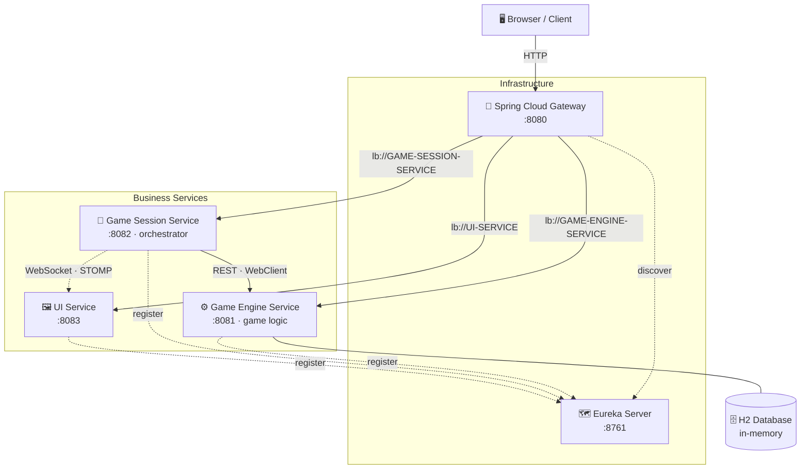
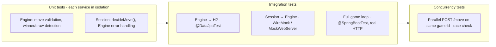

<div style="text-align:center;">

# Tic Tac Toe

**A self-playing, microservice-based Tic Tac Toe game** — the board fills itself in real time while a service orchestrator plays random moves against the game engine.


</div>

---
<div style="text-align:center;">
<pre>
 _____ _____ _   __  _____ ___   _   __  _____ _____ _____
|_   _|_   _| | / / |_   _/ _ \ | | / / |_   _|  _  |  ___|
  | |   | | | |/ /    | |/ /_\ \| |/ /    | | | | | | |__
  | |   | | |    \    | ||  _  ||    \    | | | | | |  __|
  | |  _| |_| |\  \   | || | | || |\  \   | | \ \_/ / |___
  \_/  \___/\_| \_/   \_/\_| |_/\_| \_/   \_/  \___/\____/

        ┌───┬───┬───┐
        │ X │ O │   │
        ├───┼───┼───┤
        │   │ X │ O │
        ├───┼───┼───┤
        │ O │   │ X │
        └───┴───┴───┘
</pre>
</div>

---

## 📖 Table of Contents

- [About](#about)
- [Features](#features)
- [Tech Stack](#tech-stack)
- [Architecture](#architecture)
- [How It Works](#how-it-works)
- [Getting Started](#getting-started)
  - [Prerequisites](#prerequisites)
  - [Build](#build)
  - [Run](#run)
  - [Test](#test)
- [Project Structure](#project-structure)
- [API Surface](#api-surface)
- [Roadmap](#roadmap)
- [Testing Strategy](#testing-strategy)
- [Git Workflow](#git-workflow)
- [Possible Improvements](#possible-improvements)
- [License](#license)

---

## About

This repository implements a **distributed Tic Tac Toe**: the game is not a single monolith but a set of independent services — a *game engine* (rules & persistence), a *game session* (orchestrator that plays the game), and a *UI* — connected through service discovery (Eureka) and an **API gateway**, with real-time board updates over **WebSocket**.

The assignment is treated as a production-grade distributed system: layered services, design patterns (Strategy, Repository, Adapter, DTO), proper error handling, and a comprehensive test suite — unit, integration, and concurrency.

> **Status:** 🔨 in development. The current codebase is a Spring Boot skeleton from Spring Initializr. The full architecture is designed and sequenced in milestones — see [docs/tic-tac-toe-plan.md](docs/tic-tac-toe-plan.md).
>
> **Requirements source:** the assignment is authoritative in [docs/task.md](docs/task.md) (the home assignment). The implementation plan is built on it and tracks it item-by-item.

---

## Features

| | |
|------|------|
| 🤖 **Self-playing game** | The session orchestrator picks a move (random strategy for v1), submits it, and repeats until the game ends. |
| 🏗️ **Microservice architecture** | Game engine, session orchestrator, UI, service discovery, and gateway as independent deployable units. |
| ⚡ **Real-time updates** | Board state is pushed to the browser over WebSocket (STOMP + SockJS). |
| 🗺️ **Service discovery & routing** | Netflix Eureka registers services; Spring Cloud Gateway is the single entry point (`:8080`). |
| 🗄️ **Persistent-by-design state** | H2 in-memory DB behind a real JPA repository — one line away from file-based persistence. |
| 🐳 **Dockerized** | The whole stack starts with a single `docker-compose up`. |
| 🧪 **Tested end-to-end** | Unit, integration, and concurrency tests across all services. |

---

## Tech Stack

| Layer | Technology |
|------|------|
| **Language** | [Java 21 (LTS)](https://www.oracle.com/java/technologies/downloads/) |
| **Framework** | [Spring Boot 4.1.x](https://spring.io/projects/spring-boot) |
| **Cloud** | [Spring Cloud 2025.1.0 "Oakwood"](https://spring.io/projects/spring-cloud) — Eureka, Gateway |
| **Data** | Spring Data JPA + [H2](https://www.h2database.com/) (in-memory) |
| **Realtime** | WebSocket / STOMP / SockJS |
| **HTTP Client** | Spring `WebClient` (reactive, `@LoadBalanced`) |
| **Build** | Gradle 9.x (wrapper) + Kotlin DSL |
| **Testing** | JUnit 5, Mockito, WireMock, Testcontainers *(optional)* |
| **Ops** | Docker + docker-compose |

---

## Architecture



**How the pieces fit together:**

1. The **browser** talks only to the **gateway** (`:8080`) — it never knows internal service ports.
2. The gateway routes requests **by service name** (`lb://GAME-SESSION-SERVICE`, …) using addresses it discovers from **Eureka**.
3. The **Game Session Service** orchestrates a whole game: it asks the *Engine* to create a game, calls its own move strategy, submits each move over **REST**, and after every move pushes the fresh board to the UI over **WebSocket**.
4. The **Game Engine Service** owns the rules: move validation, winner detection, and persistence to **H2**.

> A full game-cycle sequence diagram is in the [implementation plan](docs/tic-tac-toe-plan.md#one-game-cycle-sequence).

**Architectural patterns used:**

- **Orchestration** — the Game Session Service is a single central coordinator (`GameSessionOrchestrator`) that drives the auto-play workflow: create game → decide move → submit → check status → repeat. **Not a Saga**: there are no compensating operations — a failed step ends the session with an error rather than undoing earlier ones (adequate for auto-play; `task.md` doesn't require distributed atomicity).
- **Layered Architecture** inside each service (Controller → Service → Repository).
- **API Gateway + Service Discovery** — single entry point routing by service name via Eureka.
- **Ports & Adapters (partially)** — business logic depends on interfaces (`GameRepository`, `MoveStrategy`, `GameEngineClient`); concrete adapters are plugged in via DI.
- **Publish-Subscribe / Observer** — WebSocket (STOMP topic): Session publishes updates, UI subscribes.
- **DTO pattern** — JPA entities stay separate from API models.

---

## How It Works

Who does what (per `docs/task.md`):

| Component | Role in moves |
|------|------|
| **UI** | Displays the board in real time, triggers simulation (`Start Simulation` → `POST /api/sessions/{id}/simulate`), shows status and move history. **Never generates moves.** |
| **Game Session** | **Generates moves** (`decideMove()`, random strategy in v1) and orchestrates the auto-play loop. |
| **Game Engine** | **Validates and applies** moves, detects winner/draw, owns persistence. |

So: **moves are made on the backend** — the Game Session decides the move, the Engine checks and applies it. The UI only renders and triggers.

The full flow:

```
POST /api/sessions  ──▶  session starts  ──▶  Game Session creates a game in the Engine
       │                                          │
       ▼                                          ▼
   browser watches              loop:  decideMove() → POST /api/games/{id}/move
       ▲                              │
       │                              ▼
  WebSocket push ◀──────  new GameState after every move
       │
       ▼
  Board redraws until status ∈ {IN_PROGRESS, WIN, DRAW}
```

---

## Getting Started

> **Note:** the commands below run the **current skeleton** (a single Spring Boot application). Once the milestone plan lands, the whole stack will start with `docker-compose up` — see [Roadmap](#roadmap).

### Prerequisites

| Requirement | Version |
|------|------|
| [JDK](https://adoptium.net/) | **21** or newer (toolchain pinned to 21) |
| Docker + Compose | Latest *(needed from Milestone 8; not required for a local run)* |
| Gradle | **Not needed** — the repo ships a pinned [Gradle Wrapper](https://docs.gradle.org/current/userguide/gradle_wrapper.html) |

Verify your environment:

```bash
java -version        # → 21+
./gradlew --version  # → prints the pinned Gradle version
```

### Build

```bash
./gradlew build
```

Compiles, runs the tests, and produces the executable jar in `build/libs/`.

### Run

**Option A — Gradle (development):**

```bash
./gradlew bootRun
```

**Option B — executable jar (production-like):**

```bash
./gradlew bootJar
java -jar build/libs/tik-tak-toe-0.0.1-SNAPSHOT.jar
```

The application starts on **`http://localhost:8080`**.

### Test

```bash
./gradlew test
```

The human-readable test report opens from:

```bash
open build/reports/tests/test/index.html
```

### Gradle task reference

| Task | Description |
|------|------|
| `./gradlew build` | Full build — compile + test + package |
| `./gradlew test` | Run the test suite |
| `./gradlew bootRun` | Start the application |
| `./gradlew bootJar` | Package an executable jar |
| `./gradlew clean` | Delete all build outputs |

---

## Project Structure

```
tik-tak-toe/
├── .claude/                 # Claude Code workspace — commands, agents, skills, plans, hooks
│   ├── hooks/               #   Hook scripts wired up in settings.json
│   └── README.md            #   Claude Code conventions for this repo
├── docs/
│   ├── task.md              #   Assignment requirements (source of truth)
│   └── tic-tac-toe-plan.md  #   Full implementation plan & architecture
├── gradle/wrapper/          # Pinned Gradle distribution
├── src/
│   ├── main/
│   │   ├── java/com/flamingo/tiktaktoe/
│   │   │   └── TikTakToeApplication.java   # Spring Boot entry point
│   │   └── resources/
│   │       └── application.properties
│   └── test/java/com/flamingo/tiktaktoe/
│       └── TikTakToeApplicationTests.java  # Smoke test (@SpringBootTest)
├── build.gradle.kts         # Java 21 · Spring Boot 4.1.0 · Gradle Kotlin DSL
├── settings.gradle
├── gradlew / gradlew.bat    # Wrapper scripts
└── .gitignore
```

**Target structure** — the monorepo will grow to five independent services plus a shared module:

```
tik-tak-toe/
├── common/                  # Shared DTOs: GameState, MoveRequest, CellState, GameStatus
├── eureka-server/           # Service discovery                        :8761
├── gateway/                 # Spring Cloud Gateway — single entry point :8080
├── game-engine-service/     # Game rules, validation, H2 persistence   :8081
├── game-session-service/    # Orchestrator: auto-play loop + WebSocket :8082
└── ui-service/              # HTML/JS board, STOMP/SockJS client       :8083
```

---

## API Surface

> Per the implementation plan. The skeleton today exposes no endpoints yet; each route is closed by its milestone.

| Method | Path | Service | Description | Milestone |
|------|------|------|------|------|
| `POST` | `/api/games` | Engine | Create a new game (empty board) | 1 |
| `POST` | `/api/games/{id}/move` | Engine | Submit & validate a move | 1 |
| `GET` | `/api/games/{id}` | Engine | Fetch current game state | 1 |
| `POST` | `/api/sessions` | Session | Create a new session (returns immediately) | 3 |
| `POST` | `/api/sessions/{sessionId}/simulate` | Session | Trigger automated move simulation | 3 |
| `GET` | `/api/sessions/{sessionId}` | Session | Session details, move history, current state | 3 |
| `WS` | `/ws-game` → `/topic/game/{id}` | Session | Subscribe to real-time updates | 4 |
| `GET` | `/` | UI | Play in the browser | 5 |

All public routes are reachable through the gateway at `localhost:8080`.

**API docs:** each REST service (Engine, Session) exposes its OpenAPI spec and Swagger UI via **springdoc-openapi** — see `/v3/api-docs` and `/swagger-ui.html` on the service's port.

---

## Roadmap

| # | Milestone | Result |
|------|------|------|
| 0 | Environment & monorepo skeleton | 5 independent Spring Boot projects + `common` module |
| 1 | **Game Engine Service + H2** | Rules, validation, error handling, persistence — fully tested |
| 2 | Eureka Server + registration | Engine visible in the service registry |
| 3 | **Game Session Service** | Orchestrator that plays a full game automatically |
| 4 | WebSocket Session → UI | Real-time state updates |
| 5 | UI Service | Browser page rendering the live board |
| 6 | Gateway | Everything reachable through `localhost:8080` |
| 7 | Testing & validation | Integration, error-handling, and concurrency suite |
| 8 | Docker + docker-compose | Whole stack up with one command |
| 9 | Final polish & submission | README, code style, end-to-end verification |

Full details — version decisions, design patterns, and the assignment-requirements matrix — live in **[docs/tic-tac-toe-plan.md](docs/tic-tac-toe-plan.md)**.

---

## Testing Strategy



---

## Git Workflow

- `main` is always stable and runnable.
- Each **milestone** is developed on its own branch: `milestone/<number>-<short-name>` (e.g. `milestone/2-game-logic`), merged into `main` when complete.
- **Small fixes** (bug fixes, refactoring, docs) go straight to `main`.
- Commits are **atomic** — one logical step per commit, with a meaningful message.

---

## Possible Improvements

Future work, deliberately outside the current scope (tracked in the plan):

- **Minimax** move strategy instead of random (with alpha-beta pruning)
- **Early draw detection** — detect a draw (theoretically) before the board is full; a full-board check is currently sufficient
- **Full reactive stack (WebFlux)** for Engine and Session — `task.md` imposes no reactivity constraint; we currently use blocking MVC + reactive `WebClient` on the Session→Engine boundary
- **Message broker** (Kafka / RabbitMQ) instead of synchronous REST between Session and Engine
- **Persistent H2** (file mode) for state recovery across restarts
- **Persist history in a DB** — track session/move history and win/loss outcomes (who won/lost, over multiple games) instead of in-memory
- **Multiple concurrent game sessions**
- **Resilience**: built-in `@Retryable` (Spring Boot 4) on Session → Engine calls, Circuit Breaker via `resilience4j-spring-boot4` if needed
- **Observability**: MDC logging with `gameId`/`sessionId` correlation

---

## License

Distributed under the **MIT License**. See [LICENSE](LICENSE) for more information.

---

<div style="text-align:center;">

*Built for the distributed-systems Tic Tac Toe assignment. Progress is tracked milestone-by-milestone in the [implementation plan](docs/tic-tac-toe-plan.md).*

</div>
