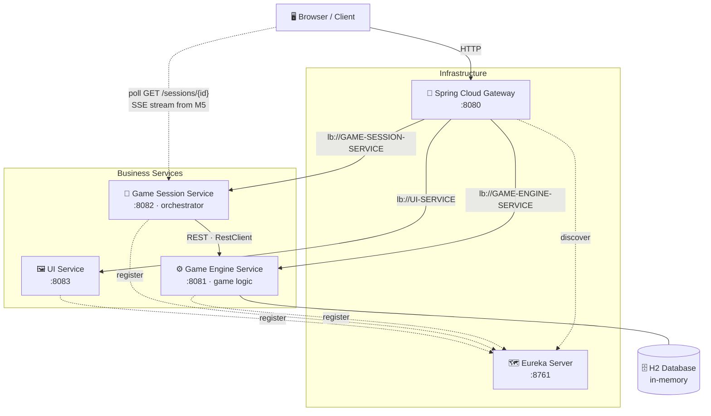

<div style="text-align:center;">

# Tic Tac Toe

**A self-playing, microservice-based Tic Tac Toe game** — the board fills itself in real time while a service orchestrator plays random moves against the game engine.

<a href="https://github.com/andrey56097/tik-tak-toe/actions/workflows/ci.yml"></a>


</div>

---
<div style="text-align:center;">
<pre>
 _____ _____ _   __  _____ ___   _   __  _____ _____ _____
|_   _|_   _| | / / |_   _/ _ \ | | / / |_   _|  _  |  ___|
  | |   | | | |/ /    | |/ /_\ \| |/ /    | | | | | | |__
  | |   | | |    \    | ||  _  ||    \    | | | | | |  __|
  | |  _| |_| |\  \   | || | | || |\  \   | | \ \_/ / |___
  \_/  \___/\_| \_/   \_/\_| |_/\_| \_/   \_/  \___/\____/

        ┌───┬───┬───┐
        │ X │ O │   │
        ├───┼───┼───┤
        │   │ X │ O │
        ├───┼───┼───┤
        │ O │   │ X │
        └───┴───┴───┘
</pre>
</div>

---

## 📖 Table of Contents

- [About](#about)
- [Features](#features)
- [Tech Stack](#tech-stack)
- [Architecture](#architecture)
- [How It Works](#how-it-works)
- [Getting Started](#getting-started)
  - [Prerequisites](#prerequisites)
  - [Build](#build)
  - [Run](#run)
  - [Test](#test)
- [Project Structure](#project-structure)
- [API Surface](#api-surface)
- [Roadmap](#roadmap)
- [Testing Strategy](#testing-strategy)
- [Continuous Integration](#continuous-integration)
- [Git Workflow](#git-workflow)
- [Possible Improvements](#possible-improvements)
- [License](#license)

---

## About

This repository implements a **Tic Tac Toe**: the game is not a single monolith but a set of independent services — a *game engine* (rules & persistence), a *game session* (orchestrator that pla[...]

The assignment is treated as a production-grade distributed system: layered services, design patterns (Strategy, Repository, Adapter, DTO), proper error handling, and a comprehensive test suite ��[...]

> **Status:** 🔨 in development, and **all three components `task.md` requires now exist and play together** — the **Game Engine** (rules, H2, upsert move endpoint), the **Game Session** orche[...]
>
> **Requirements source:** the assignment is authoritative in [docs/task.md](docs/task.md) (the home assignment). The implementation plan is built on it and tracks it item-by-item.

---

## Features

| | |
|------|------|
| 🤖 **Self-playing game** | The session orchestrator picks a move (random strategy for v1), submits it, and repeats until the game ends. |
| 🏗️ **Microservice architecture** | Game engine, session orchestrator, UI, service discovery, and gateway as independent deployable units. |
| ⚡ **Live board** | The page redraws from full session state as each move lands — by polling today, pushed over **SSE** from Milestone 5. The renderer never sees the difference. |
| 🗺️ **Service discovery & routing** | Netflix Eureka registers services today; Spring Cloud Gateway becomes the single entry point (`:8080`) in Milestone 6. |
| 🗄️ **Persistent-by-design state** | H2 in-memory DB behind a real JPA repository — one line away from file-based persistence. |
| 🐳 **Dockerized** *(planned)* | The whole stack starts with a single `docker-compose up` — isolated containers communicating over the compose network by service name. |
| 🧪 **Tested end-to-end** | Unit, integration, and concurrency tests across all services. |
| 🔄 **CI/CD** *(partial)* | GitHub Actions reviews every PR today; a build + test + quality workflow lands in Milestone 8. |

---

## Tech Stack

| Layer | Technology |
|------|------|
| **Language** | [Java 21 (LTS)](https://www.oracle.com/java/technologies/downloads/) |
| **Framework** | [Spring Boot 4.1.x](https://spring.io/projects/spring-boot) |
| **Cloud** | [Spring Cloud 2025.1.2 "Oakwood"](https://spring.io/projects/spring-cloud) — Eureka, Gateway |
| **Data** | Spring Data JPA + [H2](https://www.h2database.com/) (in-memory) |
| **Realtime** | Browser polling today → **Server-Sent Events** (native `EventSource`, no JS libraries) from Milestone 5 |
| **HTTP Client** | Spring `RestClient` (synchronous, `@LoadBalanced`, connect + read timeouts) |
| **Build** | Gradle 9.x (wrapper) + Kotlin DSL |
| **Testing** | JUnit 5, Mockito, WireMock, Testcontainers *(optional)* |
| **Ops** | Docker + docker-compose |
| **CI/CD** | GitHub Actions (build + test + quality on push/PR) · Kubernetes readiness for deployment when needed |

---

## Architecture



**How the pieces fit together:**

1. The **browser** talks only to the **gateway** (`:8080`) — it never knows internal service ports.
2. The gateway routes requests **by service name** (`lb://GAME-SESSION-SERVICE`, …) using addresses it discovers from **Eureka**.
3. The **Game Session Service** orchestrates a whole game: it calls its own move strategy and submits each move over **REST** (the move endpoint creates the game on first use), recording the fres[...]
4. The **Game Engine Service** owns the rules: move validation, winner detection, and persistence to **H2**.

> A full game-cycle sequence diagram is in the [implementation plan](docs/tic-tac-toe-plan.md#one-game-cycle-sequence).

**Architectural patterns used:**

- **Orchestration** — the Game Session Service is a single central coordinator (`GameSessionOrchestrator`) that drives the auto-play workflow: create game → decide move → submit → check s[...]
- **Layered Architecture** inside each service (Controller → Service → Repository).
- **API Gateway + Service Discovery** — single entry point routing by service name via Eureka.
- **Ports & Adapters (partially)** — business logic depends on interfaces (`GameRepository`, `MoveStrategy`, `GameEngineClient`); concrete adapters are plugged in via DI.
- **Publish-Subscribe / Observer** — `GameUpdatePublisher` (Milestone 5): Session publishes a state update, subscribed browsers receive it over SSE, and neither knows the other directly. Until [...]
- **DTO pattern** — JPA entities stay separate from API models.

---

## How It Works

Who does what (per `docs/task.md`):

| Component | Role in moves |
|------|------|
| **UI** | Displays the board in real time, triggers simulation (`Start Simulation` → `POST /sessions/{id}/simulate`), shows status and move history. **Never generates moves.** |
| **Game Session** | **Generates moves** (`decideMove()`, random strategy in v1) and orchestrates the auto-play loop. |
| **Game Engine** | **Validates and applies** moves, detects winner/draw, owns persistence. |

So: **moves are made on the backend** — the Game Session decides the move, the Engine checks and applies it. The UI only renders and triggers.

The full flow:

```
POST /sessions  ──▶  session starts  ──▶  Game Session creates a game in the Engine
       │                                          │
       ▼                                          ▼
   browser watches              loop:  decideMove() → POST /games/{id}/move
       ▲                              │
       │                              ▼
  full session state ◀──────  new GameState after every move
  (polled today, pushed over SSE from Milestone 5)
       │
       ▼
  Board redraws until status ∈ {IN_PROGRESS, WIN, DRAW}
```

---

## Getting Started

> **Note:** each service is started on its own port for now — Eureka `8761`, Engine `8081`, Session `8082`, UI `8083`. Once Milestone 9 lands, the whole stack starts with `docker-compose up` — see[...]

### Prerequisites

| Requirement | Version |
|------|------|
| [JDK](https://adoptium.net/) | **21** or newer (toolchain pinned to 21) |
| Docker + Compose | Latest *(needed from Milestone 9; not required for a local run)* |
| Gradle | **Not needed** — the repo ships a pinned [Gradle Wrapper](https://docs.gradle.org/current/userguide/gradle_wrapper.html) |

Verify your environment:

```bash
java -version        # → 21+
./gradlew --version  # → prints the pinned Gradle version
```

### Build

```bash
./gradlew build
```

Compiles and tests every module and produces one executable jar per service, in
that service's own `build/libs/` — e.g. `game-engine-service/build/libs/`. There
is no jar at the repository root: the root is a Gradle settings file that
aggregates the modules, not an application.

### Run

These are independent Spring Boot applications with no shared root project, so
there is no single "start the app" command. Start them in this order — Eureka
first, so the others have a registry to register with — each in its **own
terminal**, because every one of these commands blocks:

```bash
./gradlew :eureka-server:bootRun          # :8761  service registry
./gradlew :game-engine-service:bootRun    # :8081  rules + H2
./gradlew :game-session-service:bootRun   # :8082  orchestrator
./gradlew :ui-service:bootRun             # :8083  the board page
```

Then open **<http://localhost:8083>** and press *Start Simulation*.

> **Do not run `./gradlew bootRun` from the repository root.** The task exists in
> every module, so Gradle would try to start all four inside one build and block
> on the first — the rest never start.

Give Eureka a few seconds before the others: a service that starts while the
registry is still coming up retries on its own, but the first attempt will fail
in the log.

**Executable jars** — same idea, one per service:

```bash
./gradlew :game-engine-service:bootJar
java -jar game-engine-service/build/libs/game-engine-service-0.0.1-SNAPSHOT.jar
```

### Test

```bash
./gradlew test
```

Each module writes its own human-readable report:

```bash
open game-engine-service/build/reports/tests/test/index.html
```

To run one module's suite alone, name it — `./gradlew :game-engine-service:test`.

> **Stop the stack before running the full build.** `EurekaServerApplicationTest`
> starts the Eureka server on its real port (`DEFINED_PORT`, 8761), so
> `./gradlew build` fails with `PortInUseException` while the services are
> running locally. CI runs on a clean machine and is unaffected.

### Gradle task reference

| Task | Description |
|------|------|
| `./gradlew build` | Full build of every module — compile + test + package (also runs Pitest for the session service, so it takes a while) |
| `./gradlew test` | Run every module's test suite |
| `./gradlew :<module>:bootRun` | Start one service — e.g. `:ui-service:bootRun`. There is no root-level `bootRun`; see [Run](#run) |
| `./gradlew :<module>:bootJar` | Package one service as an executable jar |
| `./gradlew clean` | Delete all build outputs |

---

## Project Structure

```
tik-tak-toe/
├── .claude/                 # Claude Code workspace — commands, agents, skills, plans, hooks
├── docs/
... (rest of file unchanged)
