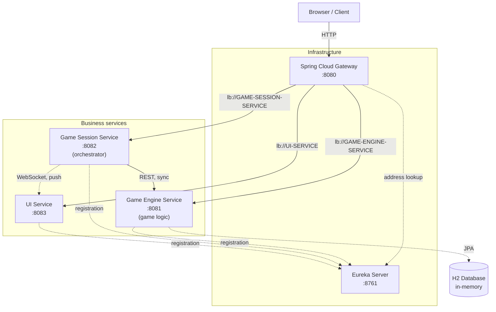
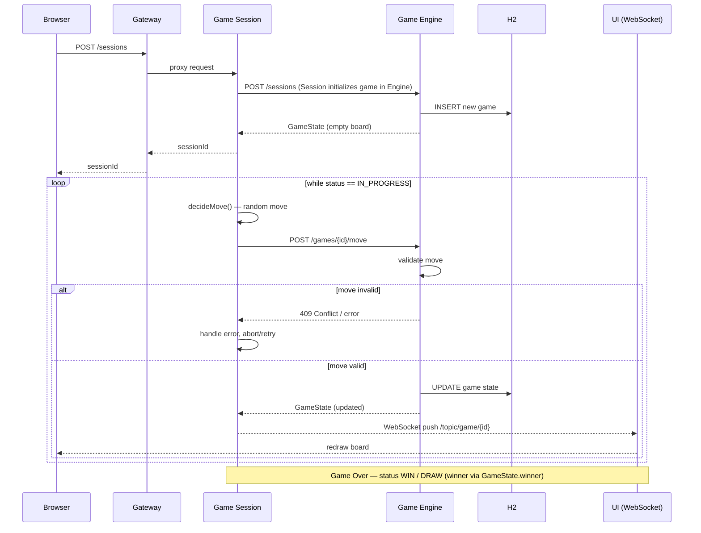
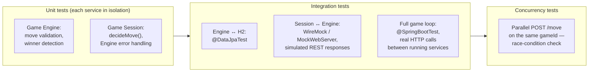

# Distributed Tic Tac Toe — Implementation Plan

> **Source of requirements:** [docs/task.md](./task.md) — the assignment. This plan is built on it and tracks it item-by-item (see «Assignment requirements coverage»). If the two ever conflict, `task.md` wins.

## Tech Stack

| Component | Technology |
|------|------|
| Language / Framework | Java 21 (LTS), Spring Boot 4.1.x |
| Spring Cloud (Eureka, Gateway) | Spring Cloud 2025.1.2 "Oakwood" — the current release train, compatible with Spring Boot 4.1.x |
| Game Engine, Game Session | Spring Web (MVC, blocking) — per `task.md`, no reactivity requirement; kept simple (KISS) |
| Gateway | Spring Cloud Gateway (WebFlux, reactive by design) |
| Service Discovery | Netflix Eureka |
| Game state storage (Engine) | **H2 (in-memory mode)** — via Spring Data JPA |
| Session state storage (Session) | **In-memory** (`ConcurrentHashMap`) for session + move history (KISS); Engine remains the persistent source of game state |
| Session ↔ Engine communication | REST via **`RestClient`** (`@LoadBalanced`, connect+read timeouts) on the Session→Engine boundary |
| Session → UI communication | WebSocket (STOMP + SockJS) |
| Move strategy (v1) | Random move (simple implementation) |
| Testing (unit) | JUnit 5 + Mockito |
| Testing (integration) | Spring Boot Test, `@SpringBootTest`, `MockWebServer` / `WireMock`, Testcontainers (optional) |
| Testing (mutation) | **Pitest** (Gradle plugin) — mutation testing is mandatory |
| API documentation | springdoc-openapi **v3.x** — Swagger UI (`/swagger-ui.html`) + OpenAPI spec (`/v3/api-docs`), generated from code |
| Containerization | Docker + docker-compose (one image per service) |
| CI (Continuous Integration) | GitHub Actions — on every push/PR: build + unit tests + mutation tests (Pitest) + quality checks. Deploy when needed via Kubernetes (Milestone 11) |
| Orchestration (optional) | Kubernetes — readiness manifests (Deployment/Service/ConfigMap/Secret) + Ingress, to deploy to a cluster when needed; complements docker-compose |
| Build | Gradle 9.5.1 (Kotlin DSL, `build.gradle.kts`), independent projects (no shared root build file with common logic, except pulling in `common` as a dependency) |
| Repository | Monorepo, 5 folders |
| Shared DTOs between services | `common` module (shared JAR), pulled in as a Gradle dependency by Engine and Session |
| Resilience (optional) | Spring Boot 4 built-in resilience (`@Retryable`, `@ConcurrencyLimit`) — no third-party library |

### Version checks for currency (August 2026)

Below is what was specifically verified and what to watch out for when generating projects via Spring Initializr.

**JUnit 5, Mockito, H2 — do not pin versions manually.** All three come via `spring-boot-starter-test` and Spring Boot's managed dependencies (the `io.spring.dependency-management` plugin, or a BOM via a Gradle version catalog) — Spring Boot pulls in versions tested with it. Pinning these libraries manually in `build.gradle.kts` is bad practice: you risk an incompatible combination. This is enough:
```kotlin
testImplementation("org.springframework.boot:spring-boot-starter-test")
testImplementation("com.h2database:h2") // no version — managed by the Spring Boot BOM
```

**Gradle 9.5.1** — pinned via the Gradle Wrapper (`gradle/wrapper/gradle-wrapper.properties`) in the repo itself, so a reviewer won't see drift from a locally installed Gradle. Keep the tech-stack table and the wrapper in sync when bumping.

**Spring Cloud version compatibility — use 2025.1.2, not 2025.1.0.** Spring Cloud 2025.1.0/2025.1.1 are compatible only with Spring Boot 4.0.x; the Spring Boot 4.1.0 compatibility was added in **Spring Cloud 2025.1.2** (released June 12, 2026, right after Boot 4.1.0). Using 2025.1.0 with Boot 4.1.0 fails at startup with "Spring Boot [4.1.0] is not compatible with this Spring Cloud release train". Pin the Cloud BOM to `2025.1.2` in gateway and eureka-server.

**Spring Cloud Gateway — an important artifact nuance.** In Spring Cloud 2025.1.x "Oakwood" the starter artifact itself was renamed: instead of the legacy `spring-cloud-starter-gateway`, it's now `spring-cloud-starter-gateway-server-webflux` (the reactive version — the one we need). If a tutorial or Spring Initializr still offers the old name, that's a sign of an outdated Spring Cloud version — the BOM needs checking.

**Resilience: Resilience4j → reconsidered in favor of Spring Boot 4 built-in resilience.** We originally planned Resilience4j as an optional improvement (a Circuit Breaker on Session → Engine calls). Research showed Spring Boot 4 (built on Spring Framework 7) now ships with **built-in** `@Retryable` and `@ConcurrencyLimit` annotations — i.e. retry and overload protection without any third-party library at all. This directly fits our KISS principle — we don't pull in a dependency where the framework already solves the problem. Resilience4j is still relevant and compatible (the package is `resilience4j-spring-boot4`, not the old `-spring-boot2`/`-spring-boot3`), but it's only needed if a full Circuit Breaker with metrics is required — for retry on Session → Engine calls, built-in `@Retryable` suffices.

**springdoc-openapi — must be v3.x with Spring Boot 4.x.** v2.x targets Spring Boot 3.x only and fails on Boot 4. For our MVC services (Engine, Session) the artifact is `org.springdoc:springdoc-openapi-starter-webmvc-ui` — v3.1.0 pairs with Spring Boot 4.1.0. Gateway (WebFlux) would need the `-webflux-ui` variant, but we keep docs **per-service** (KISS) — no gateway-level aggregation. Docs are generated from code, so they can't drift from the API.

### Why H2 instead of a bare `ConcurrentHashMap`

The assignment allows an in-memory database (*"Although an in-memory database is acceptable, consider strategies for persistent storage and data recovery"*) — H2 in in-memory mode gives us:
- a real SQL layer (`GameRepository extends JpaRepository`), not a hand-rolled map
- an easy path to persistent mode (`jdbc:h2:file:./data/games` instead of `jdbc:h2:mem:games`) with a one-line change in `application.yml`, if state recovery after restart is ever needed
- the H2 Console (`/h2-console`) for visually inspecting DB state during development/demo
- an honest demonstration of the Repository pattern, which is closer to what a "production-like" environment expects

### Why Spring Boot 4.1.x instead of 3.x

At project start (August 2026), Spring Boot 3.5 reached end of support (EOL June 30, 2026), while Spring Boot 4.1.0 is the current supported release (supported at least until July 2027). The assignment doesn't constrain the framework version, so we take the current one:
- Spring Cloud 2025.1.2 "Oakwood" — the release train compatible with Spring Boot 4.1.x (2025.1.0/2025.1.1 support only Boot 4.0.x), includes current Eureka and Gateway without changes to our architecture
- Spring Boot 4.x requires a minimum of Java 17, with support up to Java 26 — our choice of Java 21 fits entirely

---

## Design Principles and Patterns

This is a cross-cutting concern — not a separate milestone, but a requirement for **how** the code is written on each of milestones 1–6. Below is specifically what and where we apply, not abstract declarations.

### SOLID in practice

| Principle | Where it applies |
|------|------|
| **S** — Single Responsibility | `GameController` (HTTP) is separated from `GameEngineService` (logic) and from `GameRepository` (data access) — three different classes, three reasons to change |
| **O** — Open/Closed | Move strategy (`MoveStrategy`) and storage (`GameRepository`) are interfaces; to add minimax or Postgres, we don't touch existing code, we add a new implementation |
| **L** — Liskov Substitution | Any `MoveStrategy` implementation (`RandomMoveStrategy`, `MinimaxMoveStrategy`) must be interchangeable without changing the behavior of the calling code (`GameSessionOrchestrator`) |
| **I** — Interface Segregation | Not one "fat" `GameService`, but separate narrow interfaces: `MoveValidator`, `WinnerChecker`, `MoveStrategy` — a client depends only on what it actually uses |
| **D** — Dependency Inversion | `GameSessionOrchestrator` depends on the `GameEngineClient` interface, not on concrete HTTP-client code; `GameEngineService` depends on the `GameRepository` interface, not on JPA directly |

### GoF design patterns — concrete application points

**Strategy** — the most important for extensibility in this project:
```java
public interface MoveStrategy {
    MoveRequest decideMove(GameState state);
}

@Component
public class RandomMoveStrategy implements MoveStrategy {
    public MoveRequest decideMove(GameState state) { /* random free cell */ }
}

// later, without changing GameSessionOrchestrator:
@Component
public class MinimaxMoveStrategy implements MoveStrategy {
    public MoveRequest decideMove(GameState state) { /* minimax */ }
}
```
`GameSessionOrchestrator` receives `MoveStrategy` via the constructor (DI) — which implementation is active is decided in config (`@Primary`/`@Qualifier` or `application.yml`), not hardcoded.

**Repository** — the data-access abstraction (already laid in via H2/JPA), lets us swap the database without touching business logic:
```java
public interface GameRepository extends JpaRepository<GameEntity, String> {
}
// GameEngineService works with GameRepository (the interface),
// without knowing whether H2, Postgres, or MongoDB sits behind it (when switching to Spring Data Mongo)
```

**Observer / Publish-Subscribe** — already effectively used in the WebSocket pairing (a STOMP topic is pub/sub): `GameBroadcaster` publishes an event, the UI is subscribed to the topic, unaware of the Session Service's existence directly.

**Adapter** — `GameEngineClient` wraps the HTTP client behind its own interface:
```java
public interface GameEngineClient {
    GameState makeMove(String gameId, MoveRequest move);
}

@Component
public class RestGameEngineClient implements GameEngineClient {
    private final RestClient restClient;
    // REST-based implementation
}
```
If Engine is tomorrow called via gRPC or a message broker instead of REST — only `RestGameEngineClient` changes; the orchestrator (`GameSessionOrchestrator`) won't notice the difference.

**Factory / Builder** — creating `GameState`/`GameEntity` from "raw" data via static factory methods or a Builder (Lombok `@Builder`), rather than public constructors with long parameter lists — reduces the risk of getting the argument order wrong.

**Retry / Circuit Breaker** (structural resilience patterns) — retry via Spring Boot 4's built-in `@Retryable`; a full Circuit Breaker (if needed) via `resilience4j-spring-boot4`; conceptually this is a wrapper around `GameEngineClient` that doesn't change the rest of the code.

**DTO (Data Transfer Object)** — `GameState`/`MoveRequest` as separate classes from `GameEntity` (the JPA entity). This separation is already established in Milestone 1 and matters on its own: the DB entity doesn't "leak" out through the REST API, DB schema changes don't break the API contract, and vice versa.

### Architectural patterns at the system level

| Pattern | Where |
|------|------|
| **Orchestration (coordinator)** — a single central coordinator drives a multi-step workflow | `GameSessionOrchestrator` (in Session) leads the auto-play: create game → decide move → send move → check status → repeat. **Not** a Saga: no compensating operations — if a step fails, the session ends with an error rather than undoing earlier steps (adequate for auto-play; `task.md` doesn't require distributed atomicity) |
| **Layered Architecture** inside each service | Controller → Service → Repository, strictly top-down, no reverse dependencies |
| **API Gateway** | Spring Cloud Gateway — single entry point (already in the plan) |
| **Service Discovery** | Eureka (already in the plan) |
| **Ports & Adapters (Hexagonal)**, partially | Business logic (`GameEngineService`, `GameSessionOrchestrator`) depends only on interfaces (`GameRepository`, `MoveStrategy`, `GameEngineClient`); concrete implementations (JPA, REST, WebSocket) are "adapters" plugged in externally via Spring DI |
| **Publish-Subscribe / Observer** | WebSocket (STOMP topic) — Session publishes state updates, UI subscribes, neither knows the other directly |
| **Retry / Circuit Breaker** | `@Retryable` (Spring Boot 4, built-in) at the Session → Engine boundary; `resilience4j-spring-boot4` if a full Circuit Breaker is needed |

> **Why Orchestration and not Saga:** *Saga* implies compensating transactions (undo earlier steps on failure). For a self-playing Tic Tac Toe there is no business need to roll back — a failed move simply ends the session with an error. This matches `task.md` (no distributed-atomicity requirement) and KISS/YAGNI. If a compensation flow is ever needed, it can be added on top of the same orchestrator.

### KISS and DRY — how we keep an eye on these as the project goes

- **KISS**: the v1 move strategy is deliberately random, not minimax right away (already decided). We don't add a message broker when REST suffices. We don't abstract things for which there is no second implementation "on the horizon" in the project — a pattern must solve a real extensibility problem (DB, move strategy), not be added "just in case" everywhere.
- **DRY**: shared DTOs/constants (`CellState`, `GameStatus`), if duplicated between Engine and Session (Session also needs to know the `GameState` structure), go into a **shared library** — the `common` module (shared JAR with DTOs), pulled in as a Gradle dependency by both services, instead of copy-pasting identical classes. This is the only justified deviation from "fully independent" services — a shared data contract, not shared business logic.

### Bottom line: what "extensible out of the box" concretely gives us

| If tomorrow we need... | What we change | What we DON'T touch |
|------|------|------|
| Replace H2 with Postgres/MongoDB | Dependency in `build.gradle.kts` + `application.yml` + the `GameRepository` implementation | `GameEngineService`, controllers, DTOs |
| Replace random moves with Minimax | Add `MinimaxMoveStrategy`, switch the bean | `GameSessionOrchestrator`, all other code |
| Replace REST with a message broker between Session/Engine | New `GameEngineClient` implementation (e.g. `KafkaGameEngineClient`) | Orchestration business logic |
| Add SSE instead of / alongside WebSocket | New update-publisher implementation behind the `GameUpdatePublisher` interface | `GameSessionOrchestrator` |

---

## System Architecture



## One game-cycle sequence



## Roles & how a move happens

Who does what (per `task.md`):

| Component | Role in moves |
|------|------|
| **UI** | Displays the board in real time, triggers simulation (`Start Simulation` → `POST /sessions/{sessionId}/simulate`), shows status and move history. **Never generates moves.** |
| **Game Session** | **Generates moves** (`decideMove()`, random strategy in v1) and orchestrates the auto-play loop. |
| **Game Engine** | **Validates and applies** moves, detects winner/draw, owns persistence. |

So: **moves are made on the backend** — the Game Session decides the move, the Engine checks and applies it. The UI only renders and triggers.

### How it works — the flow

```
[UI]                     [Session]                          [Engine]
 │                          │                                  │
 │  POST /sessions      │  creates session, returns id     │
 │─────────────────────────>│                                  │
 │                          │  creates game in Engine (via     │
 │                          │  POST /sessions, M3)             │
 │                          │─────────────────────────────────>│
 │                          │  ── auto-play loop ──            │
 │  POST /sessions/{id} │                                  │
 │  /simulate               │  decideMove() (random)           │
 │─────────────────────────>│─────────────────────────────────>│
 │                          │  POST /games/{id}/move           │
 │                          │─────────────────────────────────>│
 │                          │        GameState (validated)     │
 │  WebSocket push          │<─────────────────────────────────│
 │◀─────────────────────────│                                  │
 │  board redraws           │  ... repeats until game ends ... │
```

1. The user clicks **Start Simulation** in the UI → `POST /sessions` → Session creates a session and returns `sessionId`.
2. The UI calls `POST /sessions/{id}/simulate` (or Session starts the loop itself).
3. **Session** (`GameSessionOrchestrator`) runs the loop: `decideMove()` (picks a cell) → sends `POST /games/{id}/move` → **Engine** validates and applies the move, returns the new `GameState`.
4. After every move Session **pushes the update over WebSocket** → UI redraws the board.
5. Repeat until `IN_PROGRESS` → `WIN` / `DRAW`.

## Testing scheme



---

## Stages and Milestones

### Milestone 0 — Environment preparation *(enabler — not a `task.md` item)*
- [ ] Create the monorepo structure (5 service folders + 1 `common` folder)
- [ ] `common` — shared module with DTOs (`GameState`, `MoveRequest`, `CellState`, `GameStatus`), pulled in as a dependency by Engine and Session (DRY, single data contract)
- [ ] Configure `.gitignore` at the root
- [ ] Initialize git, make the first commit
- [ ] Create 5 independent Spring Boot projects via Spring Initializr (Gradle + Kotlin DSL, Java 21; no shared parent build file, `common` is the only shared dependency)

**Result:** empty project skeleton, everything compiles and runs independently.

---

### Milestone 1 — Game Engine Service + H2 *(**required** — `task.md` component 1)*
- [ ] Dependencies: `spring-boot-starter-data-jpa`, `com.h2database:h2`
- [ ] `application.yml`: `jdbc:h2:mem:games;DB_CLOSE_DELAY=-1`, enable H2 Console
- [ ] Entity `GameEntity` (id, board as JSON/String, status, nextTurn) + `GameRepository extends JpaRepository<GameEntity, String>`
- [ ] DTO models: `CellState`, `GameStatus` (`IN_PROGRESS`/`WIN`/`DRAW`), `GameState` (includes `winner`: X/O/null), `MoveRequest` (includes `player`: X/O + `row`/`col`)
- [ ] `POST /games/{gameId}/move` — apply a move + validation (submitted `player` == whose turn, cell free, game not finished, bounds 0..2), update in H2; returns status `IN_PROGRESS` / `WIN` / `DRAW` + `winner` when finished
- [ ] `GET /games/{gameId}` — fetch current state from H2
- [ ] Game creation happens via `GameRepository`/H2 (Session initializes games in M3 per `task.md` — no `POST /games` endpoint in Engine)
- [ ] Winner-detection logic (check 8 lines) and draw detection
- [ ] **Error handling**: custom exceptions (`InvalidMoveException`, `GameNotFoundException`) + `@RestControllerAdvice` → proper HTTP statuses (400/404/409) instead of bare 500s
- [ ] Unit tests (JUnit 5): move validation, winner/draw detection, handling invalid moves
- [ ] `@DataJpaTest` — verify saving/reading `GameEntity` via `GameRepository`
- [ ] Wire `springdoc-openapi-starter-webmvc-ui` (v3.x) → verify `/v3/api-docs` + `/swagger-ui.html` describe the Engine API

**Result:** Game Engine works and is tested in isolation (Postman/curl + automated tests), state survives service reuse within a single run.

---

### Milestone 2 — Eureka Server + registration *(optional — `task.md` “Service Discovery / API Gateway”)*
- [ ] Stand up the Eureka Server (`@EnableEurekaServer`, port 8761)
- [ ] Add `eureka-client` to Game Engine, register under the name `GAME-ENGINE-SERVICE`
- [ ] Verify in the console at `localhost:8761` that the service appears in the registry

**Result:** Game Engine is visible in Eureka.

---

### Milestone 3 — Game Session Service (orchestrator) *(**required** — `task.md` component 2)*
- [ ] Add `eureka-client`, register as `GAME-SESSION-SERVICE`
- [ ] `RestClient` with `@LoadBalanced` to call `GAME-ENGINE-SERVICE` by name
- [ ] `decideMove()` — pick a random free cell
- [ ] Auto-play loop: create game → move → check status → repeat until the end
- [ ] `POST /sessions` — start a new game session (generate `sessionId`, optionally initialize a game in Engine) and **return immediately** (non-blocking)
- [ ] `POST /sessions/{sessionId}/simulate` — trigger the automated move simulation (alternating turns) until the game concludes
- [ ] `GET /sessions/{sessionId}` — fetch session details, move history, and current game state
- [ ] Session storage: in-memory (`ConcurrentHashMap`) for session + move history
- [ ] Pause between moves (for UI visibility)
- [ ] **Error handling / communication failures**: handle Game Engine unavailability (timeout, connection refused) — try-catch around the client calls, logging, stop the session with a clear status instead of hanging
- [ ] Unit tests: `decideMove()` on different board states, handling an erroneous Engine response (mock the client)
- [ ] Wire `springdoc-openapi` on Session → its own `/v3/api-docs` + `/swagger-ui.html`

**Result:** a game can be started through the Session Service and plays out automatically to completion, visible in the logs; Engine failures don't hang the service.

---

### Milestone 4 — WebSocket wiring Session → UI *(optional — `task.md` “Real-Time Updates”; the UI requirement itself is satisfied by any live-updating board)*
- [ ] Configure `@EnableWebSocketMessageBroker` in the Session Service
- [ ] STOMP endpoint `/ws-game`, topic `/topic/game/{sessionId}`
- [ ] Publish a state update after every move

**Result:** you can subscribe to the topic (e.g. via a test STOMP client) and see real-time updates.

---

### Milestone 5 — UI Service *(**required** — `task.md` component 3)*
- [ ] Add `eureka-client`, register as `UI-SERVICE`
- [ ] Simple HTML/JS page with a 3×3 board
- [ ] Connect via SockJS + STOMP to the Session Service
- [ ] Render the board on receiving updates
- [ ] "Start Simulation" button → create session (`POST /sessions`) → trigger `POST /sessions/{sessionId}/simulate`
- [ ] Display live status (`IN_PROGRESS` / `WIN` / `DRAW`), a move-history log, and connection errors

**Result:** you open the page, click "start", and watch the board fill itself in real time.

---

### Milestone 6 — Gateway *(optional — `task.md` “Service Discovery / API Gateway”)*
- [ ] Stand up Spring Cloud Gateway (port 8080)
- [ ] Route to `GAME-SESSION-SERVICE` (`/sessions/**`)
- [ ] Route to `GAME-ENGINE-SERVICE` (`/games/**`) — optional, for direct access/debugging
- [ ] Route to `UI-SERVICE` (`/**`, lowest priority)
- [ ] Verify that the whole flow works through the single port `localhost:8080`

**Result:** the entire system is reachable from one entry point; the browser doesn't know about internal service ports.

---

### Milestone 7 — Testing & Validation (a full block, separate from the unit tests written during development) *(**required** — `task.md` “Testing & Validation”)*

This milestone closes the assignment's **"Testing & Validation"** section entirely — item by item:

**Inter-Service Communication**
- [ ] A test confirming that Session actually retrieves a live answer from Engine over REST (not a mock — a running Engine, or WireMock emulating its contract)
- [ ] Verify correct serialization/deserialization of `MoveRequest`/`GameState` between services

**State Management**
- [ ] Test: after a series of moves, the state in H2 (Engine) matches what Session sees and what is pushed to the UI via WebSocket
- [ ] Test for state recovery on a repeated `GET /games/{id}` — data isn't "lost" between requests

**Error Handling**
- [ ] Test: an invalid move (occupied cell, wrong turn) → correct HTTP status and a clear message, the game isn't broken
- [ ] Test: Game Engine unavailable (simulated via WireMock with a delay/500 error) → Session doesn't crash, logs correctly, and ends the session with an error
- [ ] Test: requesting a non-existent `gameId` → 404, not 500

**Integration Testing — full game loop**
- [ ] `@SpringBootTest` scenario: create session → loop of automatic moves → get the final status (WIN/DRAW) — end to end, as close as possible to a real run
- [ ] Verify that WebSocket messages actually arrive on every move (via a test STOMP client in the test)

**Concurrency Handling (optional, but desirable)**
- [ ] Test: two parallel `POST /games/{id}/move` on the same `gameId` — only one should be applied, the second should get a proper error (409), without corrupting the board state
- [ ] At the code level: synchronization at write time (`@Transactional` + optimistic locking via `@Version` in `GameEntity`, or `synchronized`/`ReentrantLock` per `gameId` in the service layer)

**Mutation testing**
- [ ] Configure **Pitest** as a Gradle plugin; run `./gradlew pitest` per module
- [ ] Every new production code is covered by mutation tests; the mutant score gates acceptance — tests that let mutants survive are too weak and must be strengthened

**Result:** there is a test suite that can be run with a single command (`./gradlew test` in each module) and that proves the system actually works as a distributed one, not just "looks like" microservices.

---

### Milestone 8 — CI (Continuous Integration) *(beyond `task.md`)*
- [ ] GitHub Actions workflow: on every push/PR — `./gradlew build` (compiles + runs tests) for each service
- [ ] Run unit tests + mutation tests (Pitest) in CI; a failed check marks the PR red
- [ ] Quality checks: `./gradlew check` (or lint/spotless if configured)
- [ ] Verify that a PR cannot be merged if CI is red (branch protection / required status check, if enabled)

**Result:** every push/PR is automatically built and tested; quality gates run before merge.

---

### Milestone 9 — Docker + docker-compose *(beyond `task.md`)*
- [ ] `Dockerfile` for each of the 5 services (one image per service)
- [ ] `docker-compose.yml` at the root with all services, correct startup order (`depends_on`), and a shared network
- [ ] Verify a full startup with a single command `docker-compose up` — containers are **isolated** (each in its own container) but **communicate over the shared compose network by service name** (e.g. `http://engine:8081`), not `localhost`
- [ ] Verify shutdown with `docker-compose down`

**Result:** the whole stack comes up with one command on a clean machine; no manual per-container startup — compose handles ordering, networking, and isolation.

---

### Milestone 10 — Final polish and Submission Guidelines *(**required** — `task.md` submission checklist)*
- [ ] README.md: architecture, diagrams, run instructions (`docker-compose up`), test instructions (`./gradlew test`)
- [ ] Code style check / comments in key places (validation, orchestration, error handling) — under "adheres to Spring Boot best practices"
- [ ] A "Possible improvements / alternative approaches" section in the README (optional per the assignment, but easily covered with 5–6 items: minimax, message broker, persistent H2 instead of in-memory, multiple parallel game sessions, etc.)
- [ ] Final end-to-end run of the full game cycle several times in a row
- [ ] (optional) Retry via built-in `@Retryable` (Spring Boot 4) on Session → Engine calls; a Circuit Breaker via `resilience4j-spring-boot4` if needed
- [ ] (optional) Logging with `gameId`/`sessionId` in MDC

**Result:** the project is ready for submission — code, tests, documentation, demo.

---

### Milestone 11 — Kubernetes readiness (optional)
- [ ] `k8s/` directory with manifests for each of the 5 services: `Deployment.yaml` + `Service.yaml`
- [ ] `k8s/configmap.yaml` — shared config (service names/URLs, ports)
- [ ] `k8s/secret.yaml` — credentials (H2 / OpenRouter / gateway), referenced as secrets, never committed
- [ ] `k8s/ingress.yaml` — external access to the Gateway (port 8080)
- [ ] Eureka works in-cluster via Kubernetes Service DNS (services register by cluster service name)
- [ ] readiness/liveness probes on each Deployment; resource requests/limits
- [ ] Verify with `kubectl apply -f k8s/` (optional, local kind/minikube)

**Result:** the stack can be deployed to a Kubernetes cluster when needed, with the same isolation + service-name communication as docker-compose.

---

## Assignment requirements coverage

| Assignment requirement | Where it's closed |
|------|------|
| Inter-Service Communication | Milestone 3 (REST client) + Milestone 7 (tests) |
| State Management | Milestone 1 (H2) + Milestone 7 (tests) |
| Session Management | Milestone 3 (`POST /sessions`, `GET /sessions/{id}`, move history) |
| Automated Move Simulation | Milestone 3 (`POST /sessions/{id}/simulate`) |
| Error Handling | Milestones 1, 3 (implementation) + Milestone 7 (tests) |
| Integration Testing (full automated game flow) | Milestone 7 |
| Concurrency Handling (optional) | Milestone 7 |
| Service Discovery / API Gateway (optional) | Milestones 2, 6 |
| Data Persistence (optional) | Milestone 1 (H2, with a path to file mode) |
| Real-Time Updates (optional) | Milestone 4 (WebSocket) |
| CI (build + test + quality) | Milestone 8 |
| Kubernetes readiness (optional) | Milestone 11 |
| Code Quality | Milestone 10 |
| Documentation (README) | Milestone 10 |
| Testing (comprehensive integration tests) | Milestone 7 |
| Discussion of improvements | Milestone 10 |

## Possible future improvements (outside current scope)
- Replace random moves with Minimax
- **Early draw detection** — detect a draw (theoretically) before the board is full, not only when it's full and no winner; for auto-play, a full-board check is currently sufficient
- **Full reactive stack (WebFlux)** for Engine and Session — possible since `task.md` imposes no reactivity constraint; both services are blocking MVC today, and the Session→Engine call uses the synchronous `RestClient`
- **Persist history in a DB** — track session/move history and win/loss outcomes (who won, who lost, over multiple games) instead of in-memory; extend the in-memory design when a durable record is needed
- Message broker (Kafka/RabbitMQ) instead of synchronous REST between Session and Engine
- H2 in persistent (file) mode instead of in-memory — state recovery after restart
- Multiple parallel game sessions at once
- **Session crash-recovery during a move** — if `GameSessionOrchestrator` crashes before, during, or after the REST call to Engine, the game is left `IN_PROGRESS` with nothing to resume it (orchestration state is in-memory only in Session, no idempotency key on the Session→Engine move call). Consistent with the Orchestration-not-Saga decision above; fixing it would need persisted orchestration state + an idempotency key so Session can detect "did my last move actually apply" after a restart
